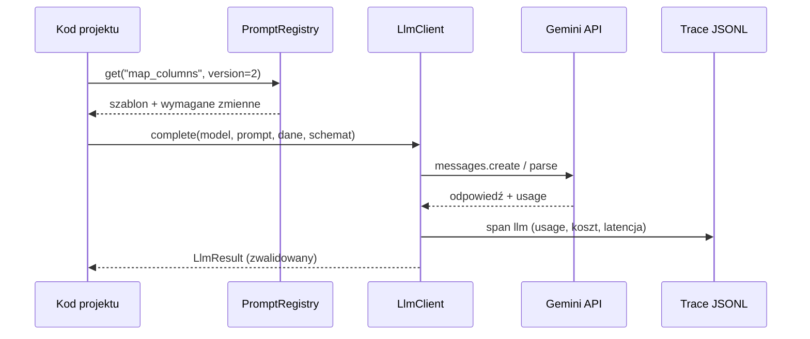

# Architektura

Dokument żywy: opisuje docelowy układ repo i kontrakty modułów wspólnych. Decyzje z uzasadnieniem są w [adr/](adr/), szczegóły pierwszej implementacji w [specs/lab-foundation/03-design.md](specs/lab-foundation/03-design.md).

## Zasady

1. Jeden pakiet Pythona `fin_ai_lab`, podpakiet per projekt ([ADR-0001](adr/0001-python-uv-single-package.md)).
2. Surowe SDK `google-genai` przed frameworkami ([ADR-0002](adr/0002-raw-sdk-before-frameworks.md)).
3. Każde wywołanie LLM przechodzi przez `core.llm` — koszt i trace są zawsze liczone.
4. Prompty żyją w plikach z numerem wersji; wyniki evali są przypięte do wersji ([ADR-0004](adr/0004-evals-first-versioned-prompts.md)).
5. Maszyna bez AVX2 i GPU: brak ciężkich usług lokalnych, trening w chmurze ([ADR-0005](adr/0005-cpu-only-machine-cloud-gpu.md)).
6. Projekty zależą od `core`; `core` nie zależy od projektów; projekty nie importują się nawzajem poza P5, który korzysta z publicznych funkcji `service.py` pozostałych.

## Układ repo

```
fin-ai-lab/
├── pyproject.toml              # extras: rag, pulse, ml, ui
├── .python-version             # 3.12
├── src/fin_ai_lab/
│   ├── cli.py                  # komenda `fin-ai-lab`
│   ├── core/
│   │   ├── config.py           # Settings z .env
│   │   ├── money.py            # Decimal, waluty, formaty PL
│   │   ├── llm/                # LlmClient, cennik, usage, trace
│   │   ├── prompts/            # PromptRegistry
│   │   ├── evals/              # zbiory, runner, graderzy, raporty
│   │   └── http/               # klient HTTP z cache i throttlingiem
│   ├── portfolio_xray/         # P1 (+ prompts/*.md)
│   ├── filings_rag/            # P2
│   ├── market_pulse/           # P3
│   ├── news_classifier/        # P4: inferencja, baseline'y
│   └── committee/              # P5
├── evals/
│   ├── <suite>/suite.yaml      # konfiguracja suity (w repo)
│   ├── <suite>/cases.jsonl     # przypadki syntetyczne lub zanonimizowane (w repo)
│   ├── baselines/<suite>.json  # podsumowanie baseline (w repo)
│   └── runs/                   # wyniki przebiegów (gitignored)
├── data/
│   ├── fixtures/               # dane testowe syntetyczne (w repo)
│   ├── private/                # prawdziwe eksporty (gitignored)
│   ├── raw/                    # pobrane dane publiczne (gitignored)
│   └── cache/                  # cache HTTP i embeddingów (gitignored)
├── notebooks/                  # trening P4 (Colab/Kaggle), eksploracja
├── tests/                      # lustro src/
├── traces/                     # trace JSONL (gitignored)
└── docs/
```

## Mapa zależności

```mermaid
flowchart TB
  subgraph projects[Projekty]
    P1[portfolio_xray]
    P2[filings_rag]
    P3[market_pulse]
    P4[news_classifier]
    P5[committee]
  end
  subgraph core[core]
    CFG[config]
    LLM[llm]
    PR[prompts]
    EV[evals]
    HTTP[http]
    MON[money]
  end
  P1 & P2 & P3 & P4 --> core
  P5 --> core
  P5 -. service.py .-> P1 & P2 & P3 & P4
  LLM --> API[(Gemini API)]
  HTTP --> EXT[(SEC, FRED, NBP, GUS, RSS, OpenFIGI)]
  EV --> LLM
```

## Kontrakty modułów core

### `core.llm`

- `LlmClient` opakowuje SDK `google-genai`. Wejście: model, prompt (z rejestru), wiadomości, opcje (budżet myślenia, schemat structured output, narzędzia, cache). Wyjście: `LlmResult` z treścią, `stop_reason`, usage (input, output, cache read, cache write), `cost_usd`, `latency_ms`, `trace_id`.
- Cennik w `core/llm/pricing.py` z datą aktualizacji. Nieznany model = wyjątek, nigdy koszt zero.
- `stop_reason` inny niż `end_turn` / `tool_use` (np. `max_tokens`, `refusal`) jest jawnie raportowany, nie połykany.
- Ponawianie przejściowych błędów zostawiamy SDK. Pętla naprawy błędów walidacji (odpowiedź niezgodna ze schematem) jest po stronie aplikacji, z limitem prób.

### Trace (JSONL)

Jedna linia na zdarzenie w `traces/<data>.jsonl`:

| Pole | Opis |
|---|---|
| `trace_id`, `span_id`, `parent_span_id` | korelacja kroków agenta |
| `ts`, `kind` | czas; `llm` / `tool` / `step` / `eval` |
| `name` | np. `portfolio_xray.map_columns` |
| `model`, `prompt_id`, `prompt_version` | dla `kind = llm` |
| `usage`, `cost_usd`, `latency_ms` | koszty i czas |
| `input_ref`, `output_ref` | skrót lub ścieżka do treści; pełna treść tylko lokalnie |
| `error` | typ i komunikat |

Klucze API nigdy nie trafiają do trace'ów. Trace mogą zawierać dane prywatne, dlatego katalog jest poza gitem.

### `core.prompts`

- Plik `src/fin_ai_lab/<projekt>/prompts/<prompt_id>.v<N>.md` z nagłówkiem: `id`, `version`, `description`, `variables`.
- Zmiana treści = nowy plik z wyższym `N`. Stare wersje zostają, bo baseline evali się do nich odwołuje.
- Renderowanie wymaga jawnego kompletu zmiennych; brak zmiennej = wyjątek.
- Dane zewnętrzne wstawiane w tagi (np. `<broker_export>…</broker_export>`) z instrukcją, że ich treść to dane.

### `core.evals`

Kontrakt i metodologia: [EVALS.md](EVALS.md).

### `core.http`

- Klient per dostawca: minimalny odstęp między żądaniami (throttling po naszej stronie), ponowienia z backoffem dla 429 i 5xx, cache na dysku kluczowany URL-em i parametrami.
- SEC: bez `SEC_USER_AGENT` klient nie startuje.
- Limity i licencje per źródło: [DATA-SOURCES.md](DATA-SOURCES.md).

### `core.money`

- Kwoty jako `Decimal` z walutą ISO 4217; parsowanie formatów PL (`1 234,56`, `12,5%`) i EN.
- Zaokrąglanie tylko przy prezentacji, jawny tryb zaokrąglania.

## Typowy przepływ wywołania



## Testy

- Testy jednostkowe bez sieci: `FakeLlmClient` odtwarza nagrane odpowiedzi.
- Testy na żywym API oznaczone `@pytest.mark.live`, domyślnie pomijane (wymagają klucza i kosztują).
- Evale nie są testami: uruchamia się je komendą `fin-ai-lab eval`, nie `pytest`.
- `tests/test_environment.py` sprawdza importy zależności natywnych (maszyna bez AVX2).

## Zależności opcjonalne (kandydaci)

Każda pozycja wymaga testu importu na tej maszynie przed dodaniem.

| Extra | Kandydaci | Projekt |
|---|---|---|
| `portfolio` | `numpy`, `pandas`, `yfinance` (zweryfikowane na tej maszynie 2026-09-16) | P1 |
| `rag` | `bm25s`, `pypdf`, `voyageai` | P2 |
| `pulse` | `mcp`, `feedparser`, `yfinance` (P1 już go dodał w `portfolio`) | P3 |
| `ml` | `scikit-learn`, `transformers` (+ `torch` CPU po weryfikacji) | P4 |
| `ui` | `fastapi`, `uvicorn` | P5 |
