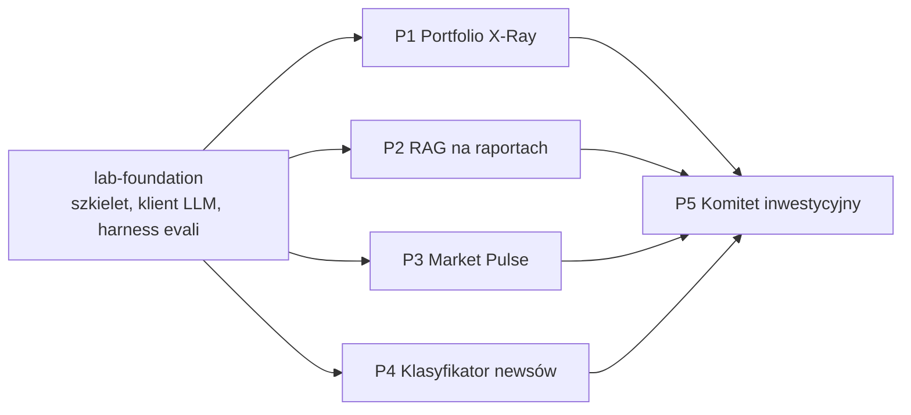

# Roadmap

Pięć projektów nauki AI engineeringu na danych rynkowych plus fundament wspólny dla wszystkich. Każdy projekt jest epikiem RoleKit; slice'y poniżej to kandydaci na tickety (PO potwierdza podział w `01-story.md`).

## Kolejność i zależności

1. **lab-foundation** — bez niego każdy projekt budowałby własny klient LLM i własne evale.
2. **P1** — najprostszy start: pojedyncze wywołania, structured outputs, pierwsze evale.
3. **P2 i P3** — w dowolnej kolejności.
4. **P4** — niezależny stack (GPU w chmurze, Python ML); może iść równolegle z P2/P3.
5. **P5** — na końcu, składa wyniki P1–P4 (do testów wystarczą atrapy).

## Umiejętności × projekty

| Umiejętność | Główny projekt | Wraca w |
|---|---|---|
| Prompt engineering, structured outputs | P1 | wszystkie |
| Ewaluacja (golden sety, LLM-as-judge, baseline) | lab-foundation, P1 | wszystkie |
| RAG (parsowanie, chunking, embeddingi, hybrid, reranking, cytaty) | P2 | P5 |
| Tool use, projekt narzędzi, MCP | P3 | P1, P5 |
| Workflow vs agent, orchestrator-workers | P3 | P5 |
| Observability, koszty, prompt caching, Batch API | P3 | P2, P4 |
| Fine-tuning (LoRA/QLoRA), destylacja, jakość danych | P4 | — |
| Multi-agent, context engineering, pamięć, HITL | P5 | — |
| Guardrails, prompt injection | P1 | P2, P5 |

## Slice'y

### lab-foundation (feature M)
- F-1 Szkielet: uv, ruff, pytest, CLI `fin-ai-lab`, test środowiska (AVX2)
- F-2 Konfiguracja z `.env` i klient LLM z liczeniem kosztów oraz trace JSONL
- F-3 Rejestr promptów w plikach z wersjami
- F-4 Harness evali MVP: zbiory JSONL, graderzy, raport, baseline, strażnik kosztów

### P1 Portfolio X-Ray
- P1-S1 Import jednego formatu brokera do schematu kanonicznego (parser deterministyczny = baseline i źródło prawdy)
- P1-S2 LLM tworzy konfigurację parsera dla nieznanego formatu + walidacja z pętlą samokorekty
- P1-S3 Identyfikacja instrumentów przez OpenFIGI (pierwsze narzędzie)
- P1-S4 Silnik metryk portfela (czysty Python)
- P1-S5 Raport opisowy + eval wierności liczb + guardrail „bez rekomendacji" + testy prompt injection
- P1-S6 Wyciągi PDF przez document input
- Później: historia transakcji w DuckDB + text-to-SQL; funkcja portfela w Analizotece (import XTB/Bossa + ręczne wprowadzanie, prezentacja wizualna) z analizą AI z tego repo jako ważnym elementem — po weryfikacji licencji danych i przeniesieniu wyników, patrz README.md

### P2 Zapytaj raport
- P2-S1 Pobranie i parsowanie 10-K (5 spółek) z podziałem na sekcje
- P2-S2 Naiwny RAG + golden set + metryki retrieval i generacji (baseline)
- P2-S3 Hybrid search (BM25 + wektory) + filtry metadanych + reranker
- P2-S4 Contextual retrieval z prompt caching — porównanie z S3
- P2-S5 Router: pytania liczbowe do XBRL, dekompozycja porównań
- P2-S6 Cytaty (Citations API) i poprawne odmowy
- P2-S7 Pytania po polsku i raporty spółek GPW (PDF)
- Później: diff sekcji Risk Factors rok do roku, GraphRAG

### P3 Market Pulse
- P3-S1 Deterministyczne wskaźniki + jedno wywołanie LLM tworzące brief
- P3-S2 Narzędzia + tool runner (pojedynczy agent)
- P3-S3 Własny MCP server z narzędziami danych
- P3-S4 Orchestrator-workers z równoległymi workerami
- P3-S5 Stan między przebiegami, wykrywanie zmian, alert
- P3-S6 Tracing i koszt per przebieg
- P3-S7 Harmonogram (Task Scheduler / GitHub Actions / Managed Agents)
- P3-S8 Evale trajektorii i backtest z anonimizacją dat

### P4 Klasyfikator newsów
- P4-S1 Korpus nagłówków, schemat etykiet, wytyczne etykietowania
- P4-S2 Etykiety teachera (Batch API) + ręczna weryfikacja + zgodność (kappa)
- P4-S3 Baseline'y: klasa większościowa, TF-IDF + regresja logistyczna, few-shot LLM
- P4-S4 Fine-tuning HerBERT (Colab)
- P4-S5 LoRA/QLoRA na małym decoderze (Bielik)
- P4-S6 Kwantyzacja i inferencja na lokalnym CPU
- P4-S7 Raport porównawczy: jakość, koszt, latencja

### P5 Komitet inwestycyjny
- P5-S1 Pojedynczy agent ze wszystkimi narzędziami (baseline)
- P5-S2 Supervisor + role-subagenci ze strukturalnymi briefami
- P5-S3 Kwant: stress testy w sandboxie
- P5-S4 Krytyk (evaluator-optimizer) i wymóg źródeł dla twierdzeń
- P5-S5 Pamięć tez i rozliczanie trafności w czasie
- P5-S6 Human-in-the-loop i budżety
- P5-S7 A/B: komitet vs pojedynczy agent
- Później: UI ze streamingiem (FastAPI + React)

## Budżet API — zasada: zero kosztów (ASSUMPTION — limity RPM/RPD do weryfikacji ręcznie wobec ai.google.dev/gemini-api/docs/pricing)

Klucz Gemini bez billingu: koszt zawsze 0 USD, projekty nie różnią się budżetem w dolarach, tylko presją na limit zapytań darmowego tieru (RPM/RPD).

| Projekt | Presja na darmowy limit | Główne źródło presji |
|---|---|---|
| lab-foundation | niska | testy integracyjne klienta, kilka wywołań |
| P1 | niska–średnia | przebiegi evali importu i raportu |
| P2 | średnia–wysoka | contextual retrieval, evale z wieloma wariantami |
| P3 | niska za przebieg, ale cykliczna | codzienne briefy — throttling musi znać harmonogram |
| P4 | wysoka w S2 (etykiety teachera), potem 0 (fine-tuning lokalny/Colab) | Batch Mode zamiast pojedynczych wywołań, żeby nie wypalić RPD |
| P5 | wysoka | wiele agentów, wiele rund w jednym przebiegu komitetu |

Zero limitu wydatków do ustawienia — klucz zostaje bez billingu. Throttling per model w `core.http`/`core.llm` (patrz [docs/LLM-API.md](LLM-API.md)) pilnuje RPM/RPD, nie budżetu w USD.

## Stan ticketów

| Ticket | 01-story | 02-spec | 03-design | Kod |
|---|---|---|---|---|
| lab-foundation | Ready for dev | Ready for dev | Ready for dev | gotowe (F-1..F-4) |
| p1-portfolio-xray | Ready for architect | Ready for architect | Ready for dev | gotowe (P1-S1..S6, evale zielone) |
| p2-filings-rag | Ready for architect | Ready for architect | Ready for dev | gotowe (P2-S1..S7). Ewale rozszerzone (`refusal_reason`, `has_citations`, pytania PL o GPW) — `p2-retrieval-accuracy` na żywo chwilowo blokowane 503 (przeciążenie Gemini, nie limit) 2026-09-18, do ponowienia |
| p3-market-pulse | Ready for architect | Ready for architect | Ready for dev | gotowe (P3-S1..S8). `p3-regime-backtest` i `p3-trajectory` oba zielone na żywo, baseline zapisane. Harmonogram (S7): skrypty w `scripts/`, rejestracja zadania na maszynie Tomasza czeka na jego uruchomienie |
| p4-news-classifier | Ready for architect | Ready for architect | Ready for dev | P4-S1..S3 gotowe — korpus (92 nagłówki, 4 źródła RSS, rośnie codziennie przez Task Scheduler), etykietowanie teachera przez Groq (drugi provider, ADR 0007; `teacher.v2.md` po naprawie 32%→0% błędów walidacji), wszystkie trzy baseline'y S3 (klasa większościowa, TF-IDF+LR, few-shot LLM). Kalibracja kappa (REQ-011) zrobiona na 86/92 nagłówkach: sentiment 0.461, event_type 0.451 — **poniżej progu 0,6** (główna przyczyna: niejasna granica `makro` vs `inne` w `teacher.v2.md`). Właściciel świadomie przyjął wynik 2026-09-19 bez poprawki promptu — odejście od REQ-011, nie błąd. P4-S4 (HerBERT, Colab) gotowe 2026-09-19: dwa fine-tune (sentiment, event_type) na 92-nagłówkowym korpusie, macro-F1 sentiment 0,254 / event_type 0,049 — model kolabsuje do klasy większościowej (`neutral`/`inne`), zgodnie z zapowiedzią notebooka to sanity check pipeline'u, nie sygnał jakości (korpus zbyt mały). P4-S7 (raport porównawczy) gotowe 2026-09-19: `fin-ai-lab news-classifier compare-report` na 13-nagłówkowym golden set (test-split ∩ human-reviewed) — majority/tfidf/herbert kolabsują do klasy większościowej (macro-F1 0.211/0.152), few-shot LLM wygrywa jakościowo (0.562/0.492) kosztem czasu (p50 2875ms) i pieniędzy (0.33 USD/1000). `torch` (CPU) zweryfikowany na tej maszynie — REQ-021 nie było blokadą. P4-S5 (LoRA/QLoRA na Bielik) gotowe 2026-09-19: `bielik_lora_finetune.ipynb`, `speakleash/Bielik-1.5B-v3.0-Instruct` (Apache 2.0). Wynik na żywo: 0/13 błędów schematu (REQ-012 — model generatywny zawsze zwrócił poprawny JSON), ale sentiment macro-F1 0,254 / event_type macro-F1 0,235 — model kolabsuje do `neutral` niezależnie od nagłówka (ta sama class-imbalance choroba co HerBERT/TF-IDF na 92-nagłówkowym korpusie). P4-S6 (kwantyzacja GGUF, lokalna inferencja CPU) kod gotowy i wykonany end-to-end 2026-09-19 — pierwsza próba: skwantyzowany model generował pustą odpowiedź, [issue #142](https://github.com/devTomaszStoklosa/fin-ai-lab/issues/142). **Naprawione 2026-09-20:** root cause znaleziony w samym llama.cpp — `LlamaHfVocab.get_token_score()` był niedokończonym stubem zwracającym `-1000.0` dla każdego tokenu, bez sygnału do preferowania scaleń BPE nad rozbiciem na bajty. Patch: `scripts/patches/llama_cpp_hf_vocab_score.patch` (liczy realny wynik z rankingu scaleń BPE), lokalna łatka na klon `tools/llama.cpp` (gitignored, nie upstream). Zweryfikowane: model odpowiada sensownym polskim tekstem na krótkich promptach (f16 i Q4_K_M). Ale **nowy problem** wykryty przy weryfikacji: pełny prompt klasyfikacyjny (~600-670 tokenów) degeneruje się przez llama.cpp (echo instrukcji z promptu) — przez `transformers` ten sam prompt daje poprawny JSON. Dalsze zawężenie 2026-09-21 wykluczyło kwantyzację, szablon czatu, batching prefill i samą długość promptu (krótki nagłówek+instrukcja działa, dłuższy narracyjny akapit+instrukcja nie, niezależnie od tokenów) — to niespójne, zależne od treści zjawisko, robocza hipoteza: krucha granica decyzyjna bardzo lekko dotrenowanego LoRA (92 nagłówki) między "kontynuuj" i "wykonaj instrukcję", przechylana różnicami numerycznymi llama.cpp vs transformers. Śledzone w [issue #160](https://github.com/devTomaszStoklosa/fin-ai-lab/issues/160), zostawione otwarte z tą diagnozą — dalsze dochodzenie (precyzja numeryczna w C++ albo solidniejszy fine-tune) nieproporcjonalne do celu repo. `p4-classifier-quantized`'s macro-F1 wciąż 0 (teraz z powodu #160, nie #142). Dalej: P5 (gotowe) |
| p5-investment-committee | Ready for architect | Ready for architect | Ready for dev | P5-S1 gotowe (pojedynczy agent, 4 narzędzia — P1/P3 realne, P2/P4 jawne atrapy). Odpalone na żywo 2026-09-19 na prawdziwym eksporcie XTB (`data/private/xtb/PLN_2949045_...xlsx`): agent poprawnie wywołał narzędzia portfela i rynku (HHI 0,2795, reżim neutral), jawnie zgłosił niepodłączone P2/P4 i zachował guardrail „bez rekomendacji". P5-S2 (supervisor + 3 role-subagenci: fundamentalny/makro/sentyment) gotowe i odpalone na żywo 2026-09-19: orchestrator-workers (ten sam wzorzec co P3-S4) — trzy wywołania LLM równolegle, supervisor składa raport bez własnych obliczeń (REQ-004), rozbieżności między perspektywami wykrywane deterministycznym leksykonem w kodzie, nie osądem LLM (REQ-002). P5-S3 (`subagents/stress.py`, integracja z supervisorem) gotowe 2026-09-19: czwarta perspektywa („Kwant") zero wywołań LLM (REQ-030) — scenariusz akcje -20%/stopy +200pb/PLN -15% liczony wyłącznie z wag portfela, ASSUMPTION: uproszczony model (bez yfinance/duration, bez FX cross-rate) wystarczający dla ilustracyjnego AC-6, nie realny risk model. Testy jednostkowe (w tym `test_supervisor.py`'s pełny `run_committee` z 4 subagentami na fake LLM) zielone; pełny żywy przebieg CLI zablokowany wyczerpanym dziennym limitem Gemini (20/dzień, free tier) podczas weryfikacji — do powtórzenia po resecie. P5-S4 (`critic.py`) gotowe 2026-09-19: evaluator-optimizer nad briefami z S2/S3 (REQ-041) — krytyk tylko ocenia, czy każde twierdzenie ma identyfikowalne źródło (jedno wywołanie LLM na brief z sygnałem, response_schema z listą werdyktów), całe przepisywanie (usunięcie niesourcowanych twierdzeń, zerowanie pewności) robi kod, nie model (02-spec.md: „ocena, nie generuje nowych twierdzeń"). Budżet wyczerpany → brief odrzucony, nigdy przepuszczony bez weryfikacji. Testy zielone (337); żywy przebieg wciąż zablokowany tym samym dziennym limitem. P5-S5 (`memory/theses.py`, `memory/calibration.py`) gotowe 2026-09-19: append-only JSONL per portfel (`data/memory/investment_committee/<portfolio_id>.jsonl`, gitignored), `reckon_theses` (czysta funkcja, REQ-010) rozstrzyga tylko mechaniczną część — czy horyzont tezy minął — i jawnie NIE ocenia trafności (brak w tym slice'ie mechanizmu osądu treści wobec rzeczywistości; `outcome` zostaje `None` dla tez z minionym horyzontem, `"not_yet_resolvable"` dla wciąż otwartych). `brier_score`/`brier_score_by_perspective` (REQ-011) liczą kalibrację z już rozliczonych tez. ASSUMPTION: dodano `Thesis.perspective`/`Thesis.confidence` — kontrakt architekta ich nie miał, a bez nich REQ-011 jest niewykonalne. Poza zakresem: żadna część pipeline'u (S1-S4) jeszcze nie zapisuje tez do pamięci — to nie jest opisane w 03-design.md's S5 rollout, wymaga odrębnej decyzji. Testy zielone (349), bez LLM (zero ryzyka limitu). P5-S6 (`budget.py`'s hak akceptacji) gotowe 2026-09-19: pytanie #3 z `01-story.md` odpowiedziane (CLI prompt) — `BudgetGuard.on_budget_exceeded` (opcjonalny hook, domyślnie `None` = ta sama cicha odmowa co przed S6) pyta o zgodę jednorazowo na przebieg (REQ-020: "najpierw prosi o akceptację", nie tylko przerywa) i, po akceptacji, nie pyta ponownie do końca przebiegu. CLI podłącza `typer.confirm` (reużywa istniejący `--yes` do auto-akceptacji, ten sam wzorzec co `_confirm_new_config`). Testy zielone (353), bez LLM. P5-S7 (`qa_target.py::compare_committee_vs_single`, REQ-050) gotowe 2026-09-19: pairwise porównanie single-agent (S1) vs komitet (S2-S6) na tym samym portfelu, z tym samym budżetem per wariant (dwa niezależne `BudgetGuard`, nie jeden wspólny), latencja mierzona `time.monotonic()` (ten sam wzorzec co `core/evals/runner.py`), jakość oceniana przez LLM-as-judge **na oślep** (sędzia widzi "raport a"/"raport b", nigdy który wariant który wyprodukował — bez biasu w stronę komitetu tylko za bycie droższym/dłuższym). CLI: `investment-committee compare <plik> --valuation-date ...`. Testy zielone (355). Żywe porównanie (metryka sukcesu ≥60% wygranych portfeli z `01-story.md`) zablokowane dwojako: dziennym limitem Gemini (wciąż wyczerpany) i otwartym pytaniem #1 z `01-story.md` (zbiór portfeli testowych) — do zrobienia po obu. **P5 (S1-S7) kod gotowy w całości.** Dalej: P1 (real-live)/P2/P3 dociąganie brakujących żywych przebiegów, albo #142/S3/S4/S7 na żywo po resecie limitu, albo pytanie #1 |
