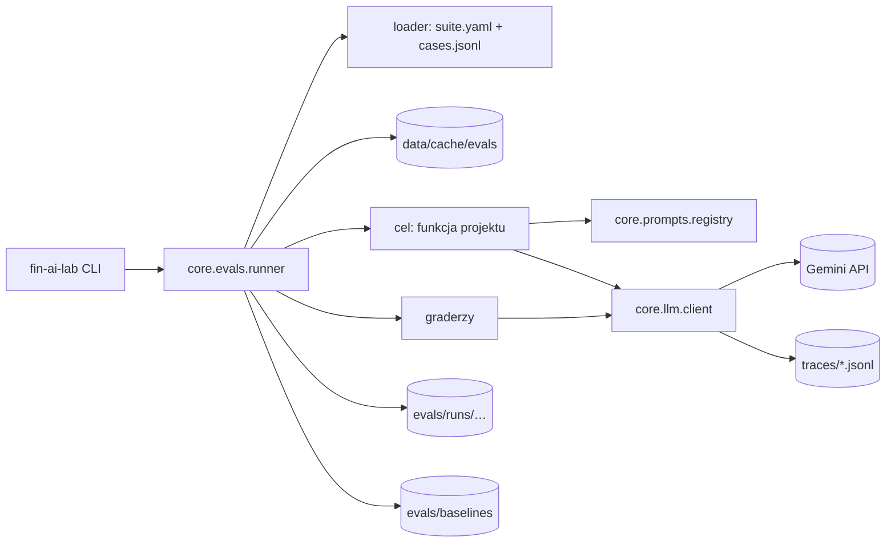

# lab-foundation - Design

Status: Ready for dev
Owner role: Architect
Upstream: 02-spec.md
ADRs: docs/adr/0001-python-uv-single-package.md, docs/adr/0002-raw-sdk-before-frameworks.md, docs/adr/0004-evals-first-versioned-prompts.md, docs/adr/0005-cpu-only-machine-cloud-gpu.md

## Context and constraints

- Jeden właściciel, repo do nauki; kod ma być czytelny bardziej niż uniwersalny.
- Python 3.12 + uv; Windows 10, ścieżka ze spacją; CPU bez AVX2, 8 GB RAM.
- Klucz API może jeszcze nie istnieć — wszystko poza testami `live` musi działać bez niego.
- RoleKit: bramki wymagają repozytorium git; artefakty w `docs/specs`.

## Quality attribute scenarios

| Source | Stimulus | Response | Measure |
|---|---|---|---|
| Właściciel | zmienia prompt i uruchamia suitę 20 przypadków | raport z deltami względem baseline | jedna komenda, < 5 min |
| Runner | szacunek kosztu powyżej limitu | pytanie o zgodę albo przerwanie | 0 niezamierzonych wydatków |
| Deweloper | `uv run pytest -q` bez sieci i klucza | zielone testy | < 30 s |
| Nowy projekt | dodaje własną suitę | działa bez zmian w `core` | tylko `suite.yaml`, `cases.jsonl`, funkcja celu |

## Options

### Option A - Własny minimalny core
`pydantic-settings`, SDK `google-genai` (klient asynchroniczny), własny runner na `asyncio`, pliki JSONL i YAML, CLI na `typer`.

### Option B - Gotowe narzędzie evali
promptfoo (CLI na Node) jako runner i raporty, w Pythonie tylko cienki klient LLM i funkcje celu.

### Option C - simplest thing that could work
Skrypty per projekt bez wspólnego core; koszty i evale liczone ad hoc.

## Trade-off matrix (1-5)

| Criterion | A | B | C |
|---|---|---|---|
| Scenario fit | 5 — wszystkie scenariusze | 4 — strażnik kosztów i trace poza narzędziem | 2 — brak baseline i porównań |
| Complexity | 3 — kilkaset linii własnego kodu | 3 — dwa ekosystemy (Node + Python) | 5 — minimalna |
| Delivery time | 3 | 4 | 5 |
| Operating cost | 5 | 5 | 3 — powtarzane wydatki bez cache |
| Risk | 4 | 3 — obce abstrakcje, konfiguracja YAML narzędzia | 2 — niewidoczne regresje |
| Reversibility | 4 — kontrakty proste, łatwo podmienić runner | 3 | 5 |
| Team familiarity | 3 — Python nowy, wzorce znane z .NET | 2 | 4 |

## Decision

Recommended: **Option A**. We give up: gotowe UI do porównań i integracje narzędzia evali. Revisit if: harness przekroczy ~1500 linii albo pojawi się potrzeba przeglądarki wyników — wtedy promptfoo albo zbiory w Langfuse.

## Diagrams



## Contracts

### Pliki

```
src/fin_ai_lab/
  cli.py                         # typer: eval, prompts list
  core/config.py                 # Settings (pydantic-settings)
  core/errors.py                 # ConfigError, PromptError, BudgetExceeded, GraderError
  core/money.py                  # parse_decimal (formaty PL i EN)
  core/llm/client.py             # LlmClient, LlmRequest, LlmResult
  core/llm/pricing.py            # ModelPrice, PRICES, PRICES_AS_OF
  core/llm/fake.py               # FakeLlmClient
  core/llm/trace.py              # TraceSink, bieżący span w contextvars
  core/prompts/registry.py       # PromptRegistry, Prompt, PromptRef
  core/evals/models.py           # Case, Suite, GraderSpec, CaseResult, RunSummary
  core/evals/loader.py
  core/evals/runner.py           # asyncio + semafor, cache, strażnik kosztów
  core/evals/cache.py
  core/evals/report.py
  core/evals/graders/            # exact, numeric, schema, set_f1, forbidden, llm_judge
  core/evals/smoke_target.py     # deterministyczny cel dla foundation-smoke
evals/foundation-smoke/suite.yaml
evals/foundation-smoke/cases.jsonl
tests/core/...
tests/test_environment.py
```

### Kontrakty (sygnatury poglądowe — nazwy typów SDK zweryfikuj w oficjalnej dokumentacji ai.google.dev, tu nie ma lokalnego skilla źródła prawdy)

```python
class LlmRequest(BaseModel):
    model: str
    system_instruction: str | None = None  # osobne pole w Gemini, nie pierwsza wiadomość
    messages: list[dict]                   # SDK message params (rola user/model)
    max_output_tokens: int = 16_000
    thinking_budget: int | None = None     # budżet tokenów myślenia; None = domyślne zachowanie modelu
    response_schema: type[BaseModel] | None = None
    tools: list[dict] | None = None        # FunctionDeclaration per narzędzie
    prompt_ref: PromptRef | None = None    # (id, version) for traces
    cache_system: bool = False             # context caching (cachedContent), inny mechanizm niż prompt cache Anthropic

class LlmResult(BaseModel):
    text: str
    parsed: BaseModel | None
    finish_reason: str                     # np. STOP, MAX_TOKENS, SAFETY
    incomplete: bool                       # max_output_tokens albo ucięcie przez safety_settings
    usage: TokenUsage                      # input, output, cache_read, cache_write
    cost_usd: Decimal
    latency_ms: int
    trace_id: str
    span_id: str

class LlmClient(Protocol):
    async def complete(self, request: LlmRequest) -> LlmResult: ...
    async def count_tokens(self, request: LlmRequest) -> int: ...

class Grader(Protocol):
    name: str
    async def grade(self, case: Case, output: object, ctx: RunContext) -> GradeResult: ...
    # GradeResult: score (0..1), passed (bool), details (dict)

# Target: async def target(case_input: dict, ctx: RunContext) -> object
# Optional estimator: async def estimate(case_input: dict, ctx: RunContext) -> Decimal
```

### Koszt

- `ModelPrice`: stawki za 1M tokenów dla wejścia, wyjścia, zapisu cache i odczytu cache. `PRICES_AS_OF` ustaw na datę ręcznej weryfikacji wobec ai.google.dev/gemini-api/docs/pricing — brak tu lokalnego skilla z migawką cennika.
- Koszt = suma (tokeny kategorii × stawka kategorii), na `Decimal`.
- Stawki context caching (zapis/odczyt) — ASSUMPTION do potwierdzenia w cenniku Gemini przed pierwszym szacunkiem; mechanizm i proporcje różnią się od prompt cache Anthropic.
- Szacunek przebiegu: estymator celu, jeśli istnieje; inaczej średni koszt przypadku z ostatniego przebiegu; inaczej „nieznany" (reguła strażnika w 02-spec).

### Cache wyników

Klucz: SHA-256 kanonicznego JSON `{target, input, prompt_versions, model, effort, repeat_index}`; plik `data/cache/evals/<klucz>.json`.

### CLI

| Komenda | Opis |
|---|---|
| `fin-ai-lab eval <suite> [--split dev\|test] [--repeats N] [--no-cache] [--save-baseline] [--yes] [--max-cost USD]` | przebieg suity |
| `fin-ai-lab prompts list` | prompty i wersje z rejestru |

### Zależności

Runtime: `google-genai`, `pydantic`, `pydantic-settings`, `pyyaml`, `typer`. Dev: `pytest`, `pytest-asyncio`, `ruff`. Każda paczka z częścią natywną (np. `pydantic-core`) trafia do `tests/test_environment.py`.

## Rollout and rollback

Kolejność slice'ów, każdy z zielonymi testami:

1. **F-1** `git init -b main`, `uv init --package`, `uv python pin 3.12`, ruff, pytest, `tests/test_environment.py`, pusty CLI. Potem ustaw `gates.dev` i `gates.qa` w `.claude/rolekit.json`.
2. **F-2** `Settings`, `errors`, `pricing`, `TraceSink`, `LlmClient` + `FakeLlmClient`; test `live` (pomijany) dla prawdziwego wywołania.
3. **F-3** `PromptRegistry` z testami wersji i zmiennych.
4. **F-4** Modele suity, loader, runner, cache, graderzy MVP, raport, baseline, strażnik kosztów; suita `foundation-smoke`.

Rollback: `git revert` — brak migracji i stanu zewnętrznego.

## Risks

| Risk | Likelihood | Impact | Mitigation |
|---|---|---|---|
| Paczka natywna nie działa bez AVX2 | niska | wysoki | test środowiska jako pierwszy krok F-1 |
| Przeinżynierowany harness | średnia | średni | tylko graderzy MVP; reszta dochodzi z projektami |
| Nieaktualny cennik | średnia | niski | `PRICES_AS_OF` w każdym raporcie |
| Zaniżony szacunek kosztu | średnia | średni | nieznany szacunek = pytanie o zgodę |
| Klucz API w trace'ach | niska | wysoki | test szuka wartości klucza w plikach trace i raportów |

## Handoff notes

- Zacznij od F-1 i `tests/test_environment.py`: na tej maszynie pierwszym ryzykiem są paczki natywne bez AVX2.
- Przed pisaniem `core/llm` sprawdź [LLM-API.md](../../LLM-API.md) i oficjalną dokumentację ai.google.dev — brak tu lokalnego skilla źródła prawdy. Nazwy typów SDK `google-genai` i kształt structured outputs/function calling sprawdź tam, nie z pamięci.
- Pułapki (`system_instruction` jako osobne pole, `thinking_budget`, `safety_settings` ucinające odpowiedzi) opisz w kodzie dopiero po weryfikacji w dokumentacji — nie przepisuj z pamięci nazw pól SDK.
- Klucza API może jeszcze nie być: testy i suita `foundation-smoke` działają na `FakeLlmClient` i deterministycznym celu.
- Stawki cache w `pricing.py` są ASSUMPTION — sprawdź w cenniku, zanim runner zacznie szacować koszty.
- Po pierwszym teście ustaw bramki RoleKit: dev = `uv run ruff check . && uv run pytest -q`, qa = `uv run pytest -q`.
- ADR-y 0001–0006 mają status Proposed — nie zmieniaj decyzji bez nowego ADR; akceptację potwierdza właściciel.
- Nie commituj bez prośby właściciela.
