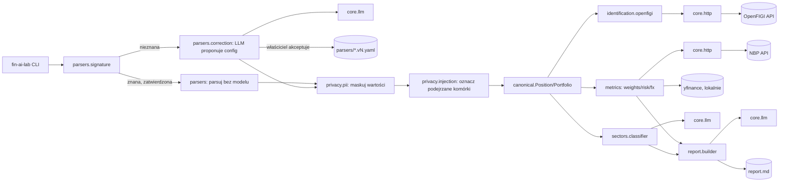

# p1-portfolio-xray - Design

Status: Ready for dev
Owner role: Architect
Upstream: 02-spec.md
ADRs: docs/adr/0001-python-uv-single-package.md, docs/adr/0002-raw-sdk-before-frameworks.md, docs/adr/0004-evals-first-versioned-prompts.md, docs/adr/0006-descriptive-reports-no-investment-advice.md

## Context and constraints

- Zależy od `lab-foundation`: `core.llm`, `core.prompts`, `core.evals` już istnieją i mają zielone testy.
- Format i struktura eksportów były nieznane w momencie pisania `01-story.md`/`02-spec.md`; teraz są dostępne prawdziwe pliki w `data/private/` (poza gitem). Sprawdzenie ich zmienia zakres:
  - `data/private/bossa/hisPW.csv` to **historia transakcji** (kolumny: `data;papier;isin;ilość;K/S;cena;wartość;prowizja;po prowizji;waluta`; `;`, Windows-1250), nie eksport pozycji — nie jest celem P1-S1.
  - `data/private/xtb/*.xlsx` ma trzy arkusze (`Closed Positions`, `Cash Operations`, `Open Positions`); `Open Positions` to rachunek CFD: `Product, Instrument/Position, Ticker, Category, Type, Volume, Value, Current price, Open price, Open time (UTC), Stop Loss, Take Profit, Net Profit %, Net Profit, Gross Profit, Margin, Open Commission, Swap, Rollover` — **bez kolumny ISIN**.
  - Arkusz `Open Positions` ma wiersze metadanych konta przed nagłówkiem (nagłówek dopiero w wierszu 9) i pod nim przeplot **wierszy podsumowania instrumentu** (`Category` niepuste, `Volume`/`Value`/`Open price` to suma/średnia ważona wszystkich otwartych transakcji tego instrumentu) z **wierszami pojedynczych transakcji** (`Category` puste, `Type='BUY'`/`'SELL'`, `Instrument/Position` = numeryczny ID transakcji, nie nazwa). Kanoniczna „Pozycja" z `02-spec.md` odpowiada wierszowi podsumowania, nie wierszowi transakcji.
- Decyzja właściciela (ta sesja): P1-S1 celuje w XTB `Open Positions`. Pozycje bez ISIN nie wywołują REQ-020 (warunek "When a position has an ISIN") i zostają ze statusem `unresolved` — to jest zgodne z AC-4, nie wymaga zmiany `02-spec.md`. Fallback identyfikacji po tickerze jest świadomie odłożony na Later (bez zapotrzebowania na niego dziś nie projektujemy go).
- Decyzja właściciela: reguła „Duplikaty" z `02-spec.md` kluczuje po ISIN; dla XTB (bez ISIN) klucz to `(broker, account_type, ticker)` w ramach jednego importu — sumowanie i ostrzeżenie jak w oryginalnej regule.
- Decyzja właściciela: `account_type` dla XTB CFD to stała `regular` zapisana w `ParserConfig`, nie odczytywana z żadnej kolumny pliku (rachunek CFD nie jest polskim rachunkiem maklerskim z IKE/IKZE).
- Decyzja właściciela: waluta bazowa raportu — **PLN, na stałe** (nie parametr runtime).
- Decyzja właściciela: klasyfikacja sektorowa (P1-S4) — **LLM z evalem**. `02-spec.md` REQ-030 nie wymienia dziś sektora jako liczonej metryki (tylko `01-story.md`'s "Dependencies and risks" go zakłada) — BA powinien dopisać linię do REQ-030 przed startem P1-S4; ten projekt architektoniczny już zakłada komponent `sectors/`.
- Decyzja właściciela: maskowanie PII (REQ-006) maskuje **wartości komórek**, nie nagłówki — model widzi strukturę (nazwy i pozycje kolumn), nie treść danych osobowych.
- Decyzja właściciela: pętla samokorekty (REQ-004) wysyła modelowi błędy walidacji **razem z surowymi wierszami**, które ich nie przeszły — nie tylko opis błędu.
- Benchmark do bety (REQ-031) zostaje parametrem `str` w kontraktach poniżej; konkretna wartość (WIG, ETF globalny, wybór użytkownika) to decyzja BA przed P1-S4, nie blokuje architektury.
- Tolerancja zgodności sumy (0,5%) i limit rozmiaru pliku (5 MB / 5000 wierszy) z `02-spec.md` przenoszone jako stałe konfigurowalne, bez zmian.

## Quality attribute scenarios

| Source | Stimulus | Response | Measure |
|---|---|---|---|
| Właściciel | wgrywa znany format (XTB Open Positions) | import bez wywołania modelu | REQ-001, < 2 s |
| Właściciel | wgrywa nieznany format | model proponuje mapowanie, właściciel akceptuje przed zapisem | REQ-002/003, < 60 s |
| Plik | komórka z instrukcją dla modelu | komórka oznaczona, instrukcja zignorowana | REQ-007/008, 0 wykonanych instrukcji |
| Plik | dane osobowe w kolumnach | model nigdy nie widzi wartości, tylko strukturę | REQ-006 |
| Nowy dostawca HTTP (NBP po OpenFIGI) | drugi provider w tym samym epiku | throttling i cache współdzielone przez `core.http`, bez duplikacji | brak nowego kodu poza jednym klientem |
| Raport | liczba w tekście | zawsze zgodna z metrics JSON | REQ-041, 0 rozbieżności |

## Options

### Option A - Wspólna infrastruktura już teraz (core.http generyczny, konfiguracje parsera wersjonowane, guardrail'e deterministyczne w kodzie)

`core/http` jako generyczny klient per dostawca (throttling, retry, cache na dysku) budowany od P1-S3, bo P1 sam potrzebuje dwóch dostawców (OpenFIGI, NBP) plus `yfinance` (lokalnie, poza `core.http`). Konfiguracje parsera jako wersjonowane pliki YAML (wzorzec `PromptRegistry` z F-3). Maskowanie PII i wykrywanie prompt injection jako deterministyczny kod, przed jakimkolwiek wywołaniem modelu.

### Option B - Ad hoc per provider, config parsera bez wersji

Klienci OpenFIGI i NBP piszą własny throttling/cache bez wspólnej abstrakcji; jedna, nadpisywana konfiguracja parsera per broker (bez wersji — nowa propozycja modelu zawsze zastępuje starą).

### Option C - Simplest thing that could work

Tylko P1-S1: jeden zahardkodowany parser dla XTB Open Positions w kodzie Python, bez pętli samokorekty (P1-S2 later), bez sektorów, bez raportu.

## Trade-off matrix (1-5)

| Criterion | A | B | C |
|---|---|---|---|
| Scenario fit | 5 — pokrywa S1–S5 | 3 — działa, ale duplikuje throttling/cache przy 2. dostawcy | 2 — tylko import, brak reszty MVP |
| Complexity | 3 | 3 | 5 — minimalna |
| Delivery time | 3 | 3 | 5 |
| Operating cost | 4 — throttling chroni darmowe limity NBP/OpenFIGI | 3 — łatwo o przypadkowe zdublowane żądania | 5 |
| Risk | 4 — reprodukowalność configów/promptów jak w evalach | 2 — nadpisana konfiguracja psuje baseline golden setu | 3 — nic do zepsucia, ale nic do pokazania |
| Reversibility | 4 — `core.http` łatwo podmienić per provider później | 3 | 5 |
| Team familiarity | 4 — ten sam wzorzec co `PromptRegistry`/harness evali z lab-foundation | 3 | 4 |

## Decision

Recommended: **Option A**. We give up: nic istotnego — koszt dodatkowy to jeden generyczny moduł `core/http` zamiast dwóch osobnych klientów. Revisit if: trzeci dostawca HTTP okaże się fundamentalnie inny (np. webhook/streaming) niż throttled request-response.

## Diagrams



## Contracts

### Pliki

```
src/fin_ai_lab/portfolio_xray/
  __init__.py
  canonical.py                    # Position, Portfolio (pydantic, z 02-spec.md)
  parsers/
    __init__.py
    signature.py                  # format signature: nagłówki + separator + kodowanie
    registry.py                   # load/store zatwierdzonych configów
    correction.py                 # pętla samokorekty (LLM, max 2 powtórzenia)
    xtb_open_positions.v1.yaml    # pierwsza zatwierdzona konfiguracja
    prompts/
      propose_config.v1.md
  privacy/
    __init__.py
    pii.py                        # klasyfikacja kolumn + maskowanie wartości (REQ-006)
    injection.py                  # oznaczanie podejrzanych komórek (REQ-007/008)
  identification/
    __init__.py
    openfigi.py                   # rozpoznanie po ISIN, reguła wyboru notowania, cache
  metrics/
    __init__.py
    weights.py                    # wagi, alokacja, HHI, efektywna liczba pozycji, top-5
    risk.py                       # zmienność, VaR, max drawdown, beta
    fx.py                         # konwersja po kursie NBP tabela A/B
  sectors/
    __init__.py
    classifier.py                 # klasyfikacja sektora przez LLM
    prompts/
      classify_sector.v1.md
  report/
    __init__.py
    builder.py                    # narracja + weryfikacja liczb (REQ-041) + stopka
    prompts/
      narrative.v1.md
  service.py                      # publiczne funkcje do ponownego użycia w P5
core/http/
  __init__.py
  client.py                       # ThrottledHttpClient: min. odstęp, retry z backoffem, cache na dysku
evals/
  p1-import-accuracy/
  p1-report-faithfulness/
  p1-no-advice/
  p1-injection/
  p1-sector-accuracy/
```

### Kontrakty (sygnatury poglądowe)

```python
class Position(BaseModel):
    broker: str
    account_type: Literal["regular", "ike", "ikze", "other"]
    instrument_name: str
    isin: str | None
    symbol: str | None
    asset_class: Literal["equity", "etf", "bond", "fund", "cash", "crypto", "derivative", "other"]
    quantity: Decimal
    avg_cost: Decimal | None
    cost_currency: str | None
    market_value: Decimal | None
    market_currency: str | None
    valuation_date: date
    resolution_status: Literal["resolved", "unresolved", "ambiguous"] = "unresolved"
    suspicious_cells: list[str] = []          # REQ-008

class Portfolio(BaseModel):
    positions: list[Position]
    base_currency: Literal["PLN"] = "PLN"
    valuation_date: date

class RowFilter(BaseModel):
    # wiersz danych liczy się jako pozycja tylko, gdy spełnia oba warunki;
    # potrzebne dla plików z wierszami podsumowania i wierszami transakcji
    # przeplecionymi w jednej tabeli (np. XTB Open Positions)
    require_non_empty: list[str] = []         # nazwy kolumn po nagłówku
    require_empty: list[str] = []

class ParserConfig(BaseModel):
    broker: str
    version: int
    sheet_name: str | None = None             # XLSX: który arkusz z wielu
    header_row: int = 1                       # 1-indeksowany wiersz z nagłówkami
    row_filter: RowFilter | None = None
    expected_headers: list[str]                # pełny wiersz nagłówków — do sygnatury
    column_mapping: dict[str, str]             # podzbiór faktycznie mapowany: nagłówek -> pole Position
    number_format: Literal["pl", "en"]
    date_format: str
    encoding: str
    delimiter: str | None

# Sygnatura formatu = hash(nagłówki znormalizowane + delimiter + encoding + sheet_name)
# dla XLSX delimiter/encoding to stałe sentinel (brak separatora/kodowania tekstowego)
def detect_signature(raw_file: bytes) -> str: ...

class ParserRegistry:
    def find_approved(self, signature: str) -> ParserConfig | None: ...
    def save(self, config: ParserConfig) -> None: ...

# Pętla samokorekty: błędy + surowe wiersze, które ich nie przeszły (decyzja właściciela)
async def propose_config(
    raw_sample: str, previous_errors: list[ValidationError] | None, failing_rows: list[str] | None
) -> ParserConfig: ...

# Maskowanie: wartości komórek klasyfikowanych jako PII, nagłówki zostają widoczne (decyzja właściciela)
def mask_pii_values(rows: list[dict]) -> list[dict]: ...
def flag_suspicious_cells(rows: list[dict]) -> list[CellFlag]: ...

class OpenFigiClient:
    async def resolve_by_isin(self, isin: str, currency: str, broker_market: str | None) -> Identification: ...

class ThrottledHttpClient:
    def __init__(self, base_url: str, min_interval_s: float, cache_dir: Path) -> None: ...
    async def get(self, path: str, params: dict) -> dict: ...

def compute_weights(portfolio: Portfolio) -> WeightMetrics: ...
def compute_risk_metrics(
    portfolio: Portfolio, benchmark_ticker: str, price_history: PriceHistory
) -> RiskMetrics: ...
def convert_to_base_currency(amount: Decimal, currency: str, valuation_date: date) -> Decimal: ...

async def classify_sector(position: Position) -> SectorClassification: ...

async def build_report(metrics: MetricsJson, instrument_metadata: dict) -> str: ...
def verify_numbers_faithful(report_text: str, metrics: MetricsJson) -> list[str]: ...  # REQ-041
```

### Format sygnatury i konfiguracji

- Sygnatura formatu: SHA-256 z kanonicznego JSON `{headers: [...], delimiter, encoding}` po normalizacji nagłówków (trim, lowercase). Ten sam mechanizm co cache evali z F-4 — konsekwentnie w całym repo.
- Konfiguracja parsera jako plik `src/fin_ai_lab/portfolio_xray/parsers/<broker>_<arkusz>.v<N>.yaml`, wzorem `PromptRegistry`: zmiana treści = nowy plik z wyższym `N`, stare wersje zostają dla reprodukowalności golden setu.

### core.http

- Jeden generyczny klient: minimalny odstęp między żądaniami per provider (`min_interval_s`), ponowienia z backoffem dla 429/5xx, cache na dysku kluczowany URL-em + parametrami (`data/cache/http/<provider>/<hash>.json`).
- OpenFIGI i NBP korzystają z tej samej klasy z różną konfiguracją (`base_url`, `min_interval_s`, nagłówki). `yfinance` **nie** przechodzi przez `core.http` (własna biblioteka Python) — cache lokalny osobny, dane nigdy nie trafiają do produktu (`01-story.md`, `DATA-SOURCES.md`).

## Rollout and rollback

1. **P1-S1** `canonical.py` (walidacja z tabeli w `02-spec.md`), `parsers/signature.py` + `parsers/registry.py` (tylko ścieżka REQ-001, config zatwierdzony ręcznie), `xtb_open_positions.v1.yaml` napisany na podstawie realnego pliku, golden set syntetyczny w `evals/p1-import-accuracy/` (anonimizowany, nie prawdziwy eksport). CLI: `fin-ai-lab portfolio import <file>`.
2. **P1-S2** `parsers/correction.py` (structured output przez `core.llm`, max 2 powtórzenia, błędy + surowe wiersze), `privacy/pii.py` + `privacy/injection.py` (maskowanie wartości, flagowanie podejrzanych komórek) — od tego slice'u treść pliku pierwszy raz trafia do modelu, więc guardrail'e muszą być gotowe *przed* nim, nie po. Eval `evals/p1-injection/`.
3. **P1-S3** `core/http/client.py`, `identification/openfigi.py` (REQ-020/021/022, cache na dysku). Dla XTB Open Positions (bez ISIN) większość pozycji zostaje `unresolved` — to znane ograniczenie MVP, nie błąd.
4. **P1-S4** `metrics/weights.py`, `metrics/risk.py` (wymaga wyboru benchmarku od BA przed startem), `metrics/fx.py` (NBP), `sectors/classifier.py` + eval `p1-sector-accuracy` (BA dopisuje sektor do REQ-030 przed startem).
5. **P1-S5** `report/builder.py`, `report/prompts/narrative.v1.md`, `verify_numbers_faithful` (REQ-041), stopka edukacyjna (REQ-042/043). Evale `p1-report-faithfulness`, `p1-no-advice`.
6. **P1-S6** (Should, nie MVP): wejście PDF — osobny addendum do tego dokumentu, gdy przyjdzie kolej.

Rollback: `git revert` per slice; brak migracji. Konfiguracje parsera i baseline'y evali są wersjonowane, więc rollback nie gubi reprodukowalności.

## Risks

| Risk | Likelihood | Impact | Mitigation |
|---|---|---|---|
| XTB CFD bez ISIN → duża część pozycji `unresolved` | wysoka | średni | udokumentowane jako znane ograniczenie MVP (AC-4 to dopuszcza); fallback po tickerze odłożony na Later |
| `yfinance` nieoficjalne, bywa blokowane | średnia | średni | tylko lokalnie, cache agresywny, pokrycie <100% jawnie raportowane (REQ-032) |
| Limity OpenFIGI bez klucza nieznane | średnia | niski | sprawdzić dokumentację przed P1-S3, throttling ustawiony konserwatywnie na start |
| Klasyfikator sektorowy (LLM) się myli | średnia | średni | własny eval `p1-sector-accuracy` skalibrowany metodologią z `EVALS.md` przed użyciem w raporcie |
| Maskowanie PII przepuszcza dane osobowe do modelu/trace | niska | wysoki | test sprawdzający brak wzorców PII (imię+nazwisko, numer rachunku) w payloadzie do `core.llm` i w plikach trace, analogicznie do testu klucza API z lab-foundation |
| REQ-030 nie wymienia sektora, a P1-S4 go liczy | wysoka (dziś) | niski | BA dopisuje linię do REQ-030 przed startem P1-S4; ten dokument już zakłada `sectors/` |

## Handoff notes

- Przed P1-S1: napisz `xtb_open_positions.v1.yaml` na podstawie realnej struktury z `data/private/xtb/` (bez kopiowania danych osobowych do repo — sam plik konfiguracji nie zawiera wartości, tylko nazwy kolumn).
- Golden set w `evals/p1-import-accuracy/cases.jsonl` musi być syntetyczny albo w pełni zanonimizowany — `01-story.md`'s "Dependencies and risks" i `docs/DATA-SOURCES.md` zasada 6 tego wymagają.
- Przed P1-S3: sprawdź limity i wymagany nagłówek OpenFIGI w ich dokumentacji, nie z pamięci — wpisz wynik do `docs/DATA-SOURCES.md` (kolumna „Limit" już ma placeholder „zależny od klucza").
- Przed P1-S4: potrzebna decyzja BA o benchmarku do bety (WIG / ETF globalny / wybór właściciela) i formalne dopisanie sektora do REQ-030.
- Nie commituj bez prośby właściciela; PR per slice, zgodnie z zasadami repo.
