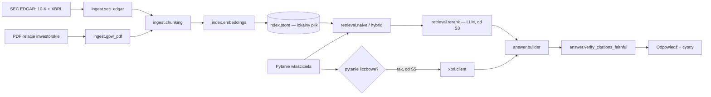

# p2-filings-rag - Architect design

Status: Ready for dev
Owner role: Architect
Upstream: 02-spec.md

ADRs touched: [0002](../../adr/0002-raw-sdk-before-frameworks.md) (raw SDK before frameworks), [0004](../../adr/0004-evals-first-versioned-prompts.md) (evals first, versioned prompts), [0005](../../adr/0005-cpu-only-machine-cloud-gpu.md) (CPU-only, cloud GPU), [0006](../../adr/0006-descriptive-reports-no-investment-advice.md) (no investment advice — applies here too, REQ-040).

## Context and constraints

- Korpus zafiksowany w `02-spec.md` REQ-001: 5 spółek US (SEC 10-K + XBRL) + 3 GPW (PDF z relacji inwestorskich). Mały, znany z góry — nie budujemy generycznego web crawlera.
- Maszyna bez AVX2/GPU ([ENVIRONMENT.md](../../ENVIRONMENT.md)): żadnego lokalnego modelu embeddingów ani rerankera z natywnymi zależnościami bez wcześniejszego testu importu. `numpy`/`pandas` już zweryfikowane w P1-S4 — reużywamy, nie dodajemy nowych ciężkich zależności bez potrzeby.
- Zero kosztów: embeddingi i reranking mają koszt per token/wywołanie — wybór technologii musi to uwzględniać, nie tylko jakość.
- `core.llm`, `core.prompts`, `core.evals`, `core.http` już istnieją (F-2..F-4) i P2 z nich korzysta, tak jak P1.
- MVP cut line z `01-story.md`: P2-S1 do P2-S4 oraz P2-S6. P2-S5 (router XBRL + dekompozycja) i P2-S7 (PL/GPW jako pełny cel, nie tylko korpus) to Should/Could — ten dokument projektuje kontrakty dla całego zakresu S1-S6, bo S5/S6 dotykają tych samych modeli danych (cytaty, XBRL), ale rollout w P2-S1..S4 nie czeka na nie.

## Quality attribute scenarios

| # | Scenario | Wymaganie |
|---|---|---|
| 1 | Pytanie o czynniki ryzyka Microsoftu | odpowiedź z cytatem (dokument, sekcja, fragment) w < 10 s |
| 2 | Pytanie o przychody Oracle za FY2025 | liczba z XBRL, nie z tekstu wygenerowanego przez model |
| 3 | Pytanie o spółkę spoza korpusu (np. Nvidia) | jawna odmowa „brak danych", nie zmyślona odpowiedź |
| 4 | Fragment 10-K zawiera tekst przypominający polecenie dla modelu | polecenie nie zmienia zachowania systemu |
| 5 | Pytanie po polsku o dokument Microsoftu (EN) | odpowiedź po polsku, cytat w oryginale (EN) |

## Options

### Retrieval dla MVP (P2-S2)

**Option A — Gemini embeddings + cosine w pamięci (Recommended).** Embeddingi liczone przez Gemini API (darmowy tier, [LLM-API.md](../../LLM-API.md) sekcja „Embeddingi"), przechowywane lokalnie (JSON/parquet per dokument), podobieństwo cosine liczone `numpy` (już zweryfikowany na tej maszynie). Korpus to kilkaset-kilka tysięcy fragmentów — pełne przeszukanie w pamięci jest szybsze niż uruchamianie silnika wektorowego.
**Option B — Lokalny model embeddingów (BGE-M3/multilingual-e5).** Zero kosztów per wywołanie, ale nowa natywna zależność ML wymagająca testu importu na maszynie bez AVX2 przed jakąkolwiek architekturą — ryzyko niezgodności ([ENVIRONMENT.md](../../ENVIRONMENT.md)). Do rozważenia tylko, jeśli Gemini embeddings okażą się zbyt drogie/wolne w evalach.
**Option C — Voyage AI (embeddingi finansowe).** Jakość może być wyższa (model dedykowany finansom), ale płatne bez darmowego tieru trwałego — sprzeczne z zasadą zero kosztów tego repo, dopóki eval nie pokaże, że Gemini nie wystarcza.
**Option D — Silnik wektorowy (FAISS/Chroma).** Nowa natywna zależność (FAISS ma warianty AVX) dla korpusu, który zmieści się w pamięci bez indeksu przybliżonego — YAGNI na tę skalę.

Decyzja: **Option A**. Rewizja przy S3 (hybrid) i S4 (contextual) — nie zmienia embeddingów, dodaje kolejne sygnały ranking.

### Reranking dla P2-S3

**Option A — LLM-as-reranker (Recommended).** Prompt ze strukturalnym wyjściem (`response_schema`) prosi model o ocenę trafności top-N kandydatów z hybrid search. Zero nowych zależności, wzorzec już używany w evalach (`llm_judge`) i w P1 (`classify_sector`).
**Option B — Cross-encoder lokalny.** Lepsza jakość per dolar, ale kolejna natywna zależność ML do weryfikacji na maszynie bez AVX2 — odrzucone na tym etapie, rewizja jeśli LLM-reranker okaże się za drogi/wolny w evalu S3.

Decyzja: **Option A**.

## Trade-off matrix (1-5, wyżej = lepiej)

| | Koszt $ | Jakość (oczekiwana) | Ryzyko na tej maszynie | Złożoność |
|---|---|---|---|---|
| Retrieval A (Gemini emb.) | 4 | 3 | 5 | 5 |
| Retrieval B (lokalny model) | 5 | 3 | 2 | 3 |
| Retrieval C (Voyage) | 2 | 4 | 5 | 4 |
| Rerank A (LLM) | 3 | 3 | 5 | 5 |
| Rerank B (cross-encoder) | 5 | 4 | 2 | 3 |

## Decision

Option A dla obu (retrieval i reranking) — zero nowych natywnych zależności ryzykownych na tej maszynie, koszt w darmowym tierze, wzorce już ugruntowane w repo (`core.llm`, structured outputs, LLM-as-judge). Rewizja architektury tylko jeśli eval z P2-S2/S3 pokaże, że jakość nie wystarcza.

## Otwarte pytania z `02-spec.md` — rozstrzygnięcie Architekta

**#1 Próg trafności (odpowiedź vs odmowa, REQ-012).** Nie ustalam liczby na pamięć. Mechanizm: `answer()` zwraca najlepszy score top-1 razem z odpowiedzią; `refusal_threshold` to parametr konfiguracji (nie constant wpisany w kod), skalibrowany empirycznie w P2-S2 na golden secie poprzez porównanie krzywej false-refuse-rate vs false-answer-rate (dokładnie tak samo jak dobieraliśmy tolerancję w P1-S5 — konfiguracja, nie zgadywanie). Do czasu pomiaru: wartość startowa `0.5` (cosine similarity), oznaczona jako ASSUMPTION w kodzie, obowiązkowo zrewidowana przy zapisywaniu baseline `p2-retrieval-accuracy`.
**#2 Format identyfikacji sekcji.** Jedno pole `section: str` (patrz `Chunk` niżej) w obu formatach, wypełniane inaczej: 10-K — standardowa etykieta Item (`"Item 1A. Risk Factors"`, sparsowana z nagłówków HTML SEC EDGAR). PDF GPW — nagłówek z zakładek/TOC PDF, gdy dostępny; w przeciwnym razie `"Strona <N>"` (fallback bez fałszywego poczucia precyzji, gdy PDF nie ma czytelnej struktury nagłówków).

## Diagrams



## Contracts

### Pliki

```
src/fin_ai_lab/filings_rag/
  __init__.py
  models.py                       # Chunk, Citation, XbrlObservation, RetrievalResult, Answer
  ingest/
    sec_edgar.py                   # fetch 10-K text + XBRL companyfacts (core.http, SEC_USER_AGENT)
    gpw_pdf.py                     # parse PDF report into Chunk (P2-S1: pypdf)
    chunking.py                    # fixed-size chunker (S2); contextual variant added in S4
  index/
    embeddings.py                  # wraps core.llm-style embedding calls, disk cache
    store.py                       # in-memory + on-disk vector store, cosine (numpy)
  retrieval/
    naive.py                       # top-k cosine (S2)
    hybrid.py                      # + BM25 (bm25s) fusion + filtry metadanych (S3)
    rerank.py                      # LLM-as-reranker (S3)
    contextual.py                  # kontekst chunku dopisany przed embeddingiem + prompt caching (S4)
  xbrl/
    client.py                      # SEC XBRL companyfacts + alias mapping + "latest filed wins" (S5, kontrakt teraz)
    tag_aliases.py                 # ręcznie trzymana mapa alias -> pojęcie (REQ-031)
  answer/
    builder.py                     # generuje odpowiedź z fragmentów/XBRL + cytaty (REQ-020)
    verify.py                      # verify_citations_faithful (REQ-020, analog P1 verify_numbers_faithful)
  qa_target.py                     # funkcje celu evali
  prompts/
    answer.v1.md
    rerank.v1.md
tests/filings_rag/                 # lustro powyżej
```

### Kontrakty (sygnatury poglądowe)

```python
class Chunk(BaseModel):
    id: str
    company: str                      # jedna z 8 spółek resolved corpus (REQ-001)
    filing_type: Literal["10-K", "annual-report-pl"]
    fiscal_period: str                 # np. "FY2025"
    section: str                       # patrz "Otwarte pytania #2" wyżej
    text: str
    source_location: str               # URL+anchor (10-K) albo "Strona <N>" (PDF)
    language: Literal["en", "pl"]

class Citation(BaseModel):
    company: str
    filing_type: str
    fiscal_period: str
    section: str
    excerpt: str                       # musi być podciągiem (po normalizacji) chunku źródłowego

class XbrlObservation(BaseModel):
    concept: str                       # po rozwiązaniu aliasów (REQ-031)
    value: Decimal
    unit: str
    fiscal_period: str
    filed: date                        # REQ-032: najnowsza wygrywa

class RetrievedChunk(BaseModel):
    chunk: Chunk
    score: float                       # cosine (S2); fused/reranked (S3+)

class RetrievalResult(BaseModel):
    chunks: list[RetrievedChunk]
    top_score: float
    company_in_corpus: bool             # REQ-012: rozróżnienie "brak w korpusie" vs "nie znaleziono"

class Answer(BaseModel):
    text: str
    citations: list[Citation]
    refused: bool
    refusal_reason: Literal["no_relevant_chunk", "company_not_in_corpus"] | None = None

def chunk_document(raw_text: str, *, company: str, filing_type: str, fiscal_period: str) -> list[Chunk]: ...

async def embed(texts: list[str], model: str) -> list[list[float]]: ...   # core.llm-style, cost-tracked

def retrieve(query: str, store: "VectorStore", *, top_k: int, refusal_threshold: float) -> RetrievalResult: ...

async def rerank(query: str, candidates: list[RetrievedChunk], llm_client: LlmClient) -> list[RetrievedChunk]: ...  # S3

async def build_answer(
    query: str, retrieval: RetrievalResult, llm_client: LlmClient, prompt_registry: PromptRegistry, model: str
) -> Answer: ...

def verify_citations_faithful(answer: Answer, chunks_by_id: dict[str, Chunk]) -> list[str]: ...  # REQ-020

class XbrlClient:
    async def observation(self, company: str, concept: str, fiscal_period: str) -> XbrlObservation | None: ...  # REQ-030/031/032
```

### `index.embeddings` — koszt i cache

- Embeddingi liczone raz per chunk, cache na dysku kluczowany hashem tekstu (ten sam wzorzec co `EvalCache`/`core.http` — SHA-256 kanonicznego tekstu). Reindeksacja korpusu nie płaci dwa razy za nie zmieniony fragment.
- Model embeddingów i jego wymiar zapisany razem z wektorem w cache — zmiana modelu unieważnia cache automatycznie (klucz zawiera nazwę modelu).

### `answer.verify_citations_faithful` (REQ-020)

Analog `portfolio_xray.report.builder.verify_numbers_faithful` z P1-S5: każdy `excerpt` w `Answer.citations` musi być (po normalizacji białych znaków) faktycznym podciągiem tekstu chunku, na który cytat wskazuje — inaczej odpowiedź jest odrzucana, tak jak P1 odrzuca raport z niezgodnymi liczbami. Zapobiega dokładnie tej samej klasie błędu: model parafrazuje albo zmyśla "cytat", który nie istnieje w źródle.

## Rollout and rollback

1. **P2-S1** `ingest/sec_edgar.py` (10-K + XBRL companyfacts dla 5 spółek US, `SEC_USER_AGENT` wymagany), `ingest/gpw_pdf.py` (3 raporty PDF GPW, `pypdf`), `ingest/chunking.py` (fixed-size), `models.py`. Test importu `pypdf`/`bm25s` na tej maszynie przed użyciem (ENVIRONMENT.md), zanim slice się zamknie — analog testu numpy/pandas z P1-S4.
2. **P2-S2** `index/embeddings.py` (Gemini embeddings + cache), `index/store.py` (cosine w pamięci), `retrieval/naive.py`, `answer/builder.py` + `verify.py`, golden set + eval `p2-retrieval-accuracy` (retrieval@5) i `p2-answer-accuracy` (poprawność + cytaty) — to jest baseline, o który proszą REQ-010/011/012/020.
3. **P2-S3** `retrieval/hybrid.py` (BM25 przez `bm25s` + fuzja z cosine), `retrieval/rerank.py` (LLM-as-reranker), filtry metadanych (company/fiscal_period). Porównanie z baseline S2.
4. **P2-S4** `retrieval/contextual.py` (kontekst chunku dopisany przed embeddingiem, prompt caching dla kosztu) — porównanie z S3.
5. **P2-S5** (Should) `xbrl/client.py` + `xbrl/tag_aliases.py`, router pytanie-liczbowe-vs-opisowe, dekompozycja porównań rok-do-roku (REQ-021/030-033). Kontrakt `XbrlClient` zdefiniowany teraz, implementacja później.
6. **P2-S6** (MVP) Citations w `Answer.citations` + `verify_citations_faithful` już zaprojektowane od S2 (REQ-020 nie czeka na osobny slice) — S6 to głównie eval `p2-citation-faithfulness` + `p2-refusal-accuracy` (AC-4/AC-6), analog `p1-report-faithfulness`.
7. **P2-S7** (Could) rozszerzenie poza 8-spółkowy korpus — nie projektowane teraz.

Rollback: `git revert` per slice, brak migracji. Cache embeddingów na dysku (gitignored) — bezpieczny do usunięcia, reindeksacja tylko kosztuje ponowne wywołania.

## Risks

- **Gemini embeddings jakość vs finansowy żargon.** Model ogólnego przeznaczenia może gubić niuanse (np. różnicę między "revenue" i "operating income"). Mitygacja: golden set w P2-S2 mierzy to konkretnie przed przejściem dalej; Option C (Voyage) zostaje jako rewizja, nie domysł na starcie.
- **PDF GPW bez ustandaryzowanej struktury.** Fallback `"Strona <N>"` (patrz Otwarte pytania #2) obniża jakość cytatu dla czytelnika, ale nie fałszuje go.
- **Koszt embeddingów przy reindeksacji.** Cache per-tekst (patrz `index.embeddings`) ogranicza to do rzeczywistych zmian treści.
- **`bm25s`/`pypdf` na maszynie bez AVX2.** Test importu obowiązkowy w P2-S1 przed jakimkolwiek kodem, który na nich polega (ENVIRONMENT.md).

## Handoff notes

- Dev zaczyna od P2-S1 (bez LLM, deterministyczne parsowanie) — może iść równolegle z weryfikacją zależności natywnych.
- `XbrlClient`/`tag_aliases.py` mają kontrakt gotowy w S1, ale realną implementację dopiero w S5 — nie blokuje S2-S4.
- `verify_citations_faithful` projektowany od razu (nie czeka na S6), bo `answer.builder` bez niego nie spełnia REQ-020 już w S2.
