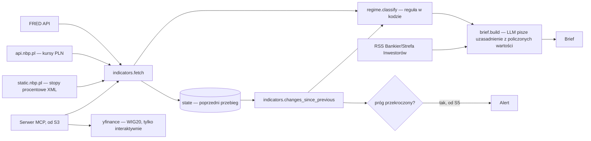

# p3-market-pulse - Architect design

Status: Ready for dev
Owner role: Architect
Upstream: 02-spec.md

ADRs touched: [0002](../../adr/0002-raw-sdk-before-frameworks.md) (raw SDK before frameworks), [0004](../../adr/0004-evals-first-versioned-prompts.md) (evals first, versioned prompts), [0005](../../adr/0005-cpu-only-machine-cloud-gpu.md) (CPU-only, cloud GPU — no impact here, no ML model), [0006](../../adr/0006-descriptive-reports-no-investment-advice.md) (no investment advice — REQ-052).

## Context and constraints

- `01-story.md`'s slice sequence (S1 workflow → S2 tool-use agent → S3 MCP → S4 orchestrator-workers) is a deliberate learning progression through agent patterns, not a set of alternatives to pick one from — this design doesn't re-decide that ordering, only the data/classification contracts each slice needs.
- Zero-cost rule (CLAUDE.md #9) and `core.llm`/`core.http` throttling apply exactly as in P1/P2.
- `core.llm`, `core.prompts`, `core.evals`, `core.http` already exist and P3 reuses them.
- Regime classification is a deterministic, code-computed rule (CLAUDE.md #2, REQ-010) — the model explains, it doesn't decide the label.

## Quality attribute scenarios

| # | Scenario | Wymaganie |
|---|---|---|
| 1 | Codzienny przebieg, wszystkie źródła dostępne | brief z pełnym zestawem wskaźników, oceną reżimu i uzasadnieniem przed 8:00 |
| 2 | FRED albo NBP niedostępne w danym dniu | brief z resztą źródeł, brakujące źródło wymienione, reżim liczony na tym co jest |
| 3 | Wskaźnik przekracza skonfigurowany próg zmiany | alert wysłany z opisem zmiany |
| 4 | Brak przekroczenia progu | brak alertu — cisza to też poprawny wynik |
| 5 | News zawiera tekst przypominający polecenie dla modelu | tekst nie zmienia zachowania agenta |
| 6 | Właściciel pyta interaktywnie (Claude Desktop/Code) o WIG20 | narzędzie MCP zwraca wartość z `yfinance` — poza automatycznym przebiegiem |

## Otwarte pytania z `02-spec.md` — rozstrzygnięcie Architekta

**#1 WIG20.** Sprawdzone na żywo (2026-09-17): GPW wymaga płatnej licencji na dane rynkowe (już wykluczone w `docs/DATA-SOURCES.md`), `yfinance` jest wykluczone z automatów tą samą tabelą, `stooq.pl`/`stooq.com` wymaga rozwiązania wyzwania JS (`__verify`, proof-of-work) nawet dla endpointu CSV — ochrona antybotem, wykluczone zasadą 5. **Decyzja:** WIG20 nie wchodzi do automatycznego codziennego briefu (P3-S1/S5/S7). Dostępne wyłącznie przez narzędzie interaktywne w serwerze MCP (P3-S3, `yfinance`) — to inny przypadek użycia (człowiek świadomie odpytuje raz, nie nienadzorowany cron), więc ograniczenie „nie w automatach" (o niestabilności, nie o licencji) nie ma tu zastosowania. Ryzyko (Yahoo bywa blokowane) zostaje jawne w docstringu narzędzia.

**#2 Stopa referencyjna NBP.** Sprawdzone na żywo (2026-09-17): `api.nbp.pl` (już w `docs/DATA-SOURCES.md`) obejmuje tylko kursy walut i ceny złota — nie stopy procentowe. Znaleziony inny, publiczny, bez klucza, bez ochrony antybotem plik: `https://static.nbp.pl/dane/stopy/stopy_procentowe.xml` (XML z aktualną stopą referencyjną, lombardową, depozytową itd. + data obowiązywania od). **Decyzja:** ten plik jako źródło stopy referencyjnej, dodany jako osobny wpis w `docs/DATA-SOURCES.md` (inny host/endpoint niż istniejący wpis NBP).

## Diagrams



## Contracts

### Pliki

```
src/fin_ai_lab/market_pulse/
  __init__.py
  models.py                       # IndicatorObservation, Brief, Alert
  sources/
    fred.py                       # FRED API (core.http, throttling per docs/LLM-API.md wzorzec)
    nbp.py                        # api.nbp.pl (kursy PLN) + static.nbp.pl (stopy procentowe XML)
    news.py                       # RSS Bankier + Strefa Inwestorów, przycinanie per DATA-SOURCES.md
  indicators.py                   # fetch wszystkich skonfigurowanych wskaźników + changes_since_previous
  regime.py                       # classify() — reguła deterministyczna (kontrakt teraz, kalibracja w P3-S8)
  alerts.py                       # threshold check -> Alert | None (S5)
  state.py                        # zapis/odczyt poprzedniego przebiegu (JSON na dysku, S5)
  brief.py                        # generuje tekst uzasadnienia z policzonych wartości (LLM, S1)
  mcp_server.py                   # serwer MCP wystawiający narzędzia z sources/ (S3)
  prompts/
    brief.v1.md
qa_target.py                       # funkcje celu evali (S8)
tests/market_pulse/                 # lustro powyżej
```

### Kontrakty (sygnatury poglądowe)

```python
class IndicatorObservation(BaseModel):
    series_id: str                     # np. "DGS10", "EUR/PLN", "stopa_referencyjna"
    label: str
    value: Decimal
    unit: str
    as_of_date: date                    # może być wcześniejszy niż dzień przebiegu
    source: Literal["fred", "nbp-fx", "nbp-rate"]
    previous_value: Decimal | None = None
    change: Decimal | None = None       # value - previous_value, liczone w kodzie

class RegimeResult(BaseModel):
    regime: Literal["risk-on", "neutral", "risk-off"]
    signals: list[str]                  # które wskaźniki/progi o tym zdecydowały (REQ-011)

class Brief(BaseModel):
    date: date
    regime: Literal["risk-on", "neutral", "risk-off"]
    regime_rationale: list[str]
    indicators: list[IndicatorObservation]
    missing_sources: list[str]
    text: str                            # uzasadnienie napisane przez LLM z powyższych danych

class Alert(BaseModel):
    series_id: str
    previous_value: Decimal
    new_value: Decimal
    threshold: Decimal
    message: str

async def fetch_indicators(config: "IndicatorConfig") -> list[IndicatorObservation]: ...  # S1

def changes_since_previous(
    current: list[IndicatorObservation], previous: list[IndicatorObservation]
) -> list[IndicatorObservation]: ...  # S5, no-op (previous_value=None) before state exists

def classify_regime(indicators: list[IndicatorObservation]) -> RegimeResult: ...  # deterministyczne, REQ-010

def check_alerts(
    indicators: list[IndicatorObservation], thresholds: dict[str, Decimal]
) -> list[Alert]: ...  # S5, REQ-020/021

async def build_brief(
    indicators: list[IndicatorObservation],
    regime: RegimeResult,
    missing_sources: list[str],
    llm_client: LlmClient,
    prompt_registry: PromptRegistry,
    model: str,
) -> Brief: ...  # S1
```

### `sources/nbp.py` — dwa różne endpointy NBP

- `fetch_fx_rate(code: str) -> Decimal` — `api.nbp.pl/api/exchangerates/rates/a/{code}/` (istniejący wpis w `docs/DATA-SOURCES.md`).
- `fetch_reference_rate() -> tuple[Decimal, date]` — `static.nbp.pl/dane/stopy/stopy_procentowe.xml`, parsuje `<pozycja id="ref" oprocentowanie="..." obowiazuje_od="...">`. Plik statyczny, bez throttlingu narzuconego przez NBP, ale `core.http` i tak stosuje minimalny odstęp między żądaniami (zasada 2, `docs/DATA-SOURCES.md`) — ten sam wzorzec co reszta klientów.

### `regime.classify_regime` — reguła (REQ-010)

Kontrakt: czysta funkcja `wskaźniki -> RegimeResult`, wywoływana **przed** jakimkolwiek promptem do modelu — `build_brief` dostaje już policzony wynik, nigdy go nie zgaduje. Dokładne wagi/progi (np. próg VIX, próg odwrócenia krzywej `T10Y2Y`) to ASSUMPTION w kodzie do kalibracji w P3-S8 (backtest) — analogicznie do `refusal_threshold` w P2. Nie ustalam tych liczb na pamięć.

### `alerts.check_alerts` — progi (REQ-020/021/022)

Próg per `series_id`, konfiguracja (nie constant wpisany w kod) — wartości startowe ASSUMPTION, oznaczone w kodzie, kalibrowane tak jak reguła reżimu.

## Rollout and rollback

1. **P3-S1** `models.py`, `sources/fred.py`, `sources/nbp.py` (obie funkcje), `indicators.py` (bez `changes_since_previous`, bo brak jeszcze stanu), `regime.py` (kontrakt + startowa reguła ASSUMPTION), `brief.py` + `prompts/brief.v1.md`. Test importu httpx-klientów bez sieci (nagrane odpowiedzi), jeden test na żywo per źródło (jak w P2 `test_client_live.py`).
2. **P3-S2** narzędzia (`sources/*` jako `FunctionDeclaration`) + tool runner — agent sam dobiera, które źródła odpytać.
3. **P3-S3** `mcp_server.py` wystawia te same narzędzia + `yfinance` (WIG20, tylko tu — Otwarte pytania #1).
4. **P3-S4** orchestrator-workers — równoległe pobranie źródeł, synteza.
5. **P3-S5** `state.py`, `changes_since_previous` realnie liczone, `alerts.py`, kanał alertu (`01-story.md` open question #1 — nadal do Tomasza, nie blokuje S1-S4).
6. **P3-S6** trace/koszt — reużycie `core.llm`/`core.http`, nic nowego do zaprojektowania.
7. **P3-S7** harmonogram — decyzja Tomasza (`01-story.md` open question #2), nie blokuje kodu z S1-S6.
8. **P3-S8** `qa_target.py`, eval trajektorii + backtest z anonimizacją dat — kalibracja progów z `regime.py`/`alerts.py` tutaj, nie wcześniej na pamięć.

Rollback: `git revert` per slice, brak migracji. Stan z `state.py` to plik JSON (gitignored) — bezpieczny do usunięcia, przebieg po prostu zacznie od nowa bez `previous_value`.

## Risks

- **Reguła reżimu źle skalibrowana.** Mitygacja: P3-S8 backtest mierzy to konkretnie; do tego czasu wartości oznaczone ASSUMPTION w kodzie, nie traktowane jako gotowe.
- **`yfinance` blokowany przez Yahoo.** Dotyczy tylko interaktywnego narzędzia WIG20 (Otwarte pytania #1) — brak wpływu na automatyczny brief.
- **FRED/NBP niedostępne w dniu przebiegu.** REQ-002/013 — brief z resztą źródeł, nie cały przebieg pada.
- **`static.nbp.pl` zmieni strukturę XML bez ostrzeżenia.** Ryzyko małe (format stabilny historycznie), ale parser powinien fail loud (błąd parsowania, nie cicha wartość domyślna) — nigdy nie zgaduj stopy referencyjnej.

## Handoff notes

- Dev zaczyna od P3-S1 — deterministyczne pobranie danych + jedno wywołanie LLM na uzasadnienie, brak jeszcze agenta/narzędzi.
- `regime.py`/`alerts.py` mają kontrakt gotowy od S1, ale progi to jawne ASSUMPTION do kalibracji w S8 — nie blokuje wcześniejszych slice'ów.
- WIG20 (`yfinance`) wchodzi dopiero w S3, jako narzędzie MCP — nie wcześniej, i nigdy w automatycznym przebiegu S1/S5/S7.
