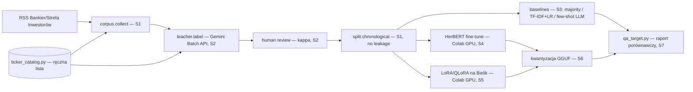

# p4-news-classifier - Architect design

Status: Ready for dev
Owner role: Architect
Upstream: 02-spec.md

ADRs touched: [0001](../../adr/0001-python-uv-single-package.md) (jeden pakiet, podpakiety per projekt), [0002](../../adr/0002-raw-sdk-before-frameworks.md) (surowe SDK przed frameworkami — nie dotyczy `transformers`/PEFT/TRL, to domenowe narzędzia fine-tuningu, których ten projekt uczy wprost, nie warstwa orkiestracji agentów), [0003](../../adr/0003-gemini-api-primary-open-weights-finetuning.md) (Gemini jako teacher, open-weight do fine-tuningu — dokładnie ten podział), [0005](../../adr/0005-cpu-only-machine-cloud-gpu.md) (CPU bez AVX2/GPU — S4/S5 muszą iść do Colab), [0006](../../adr/0006-descriptive-reports-no-investment-advice.md) (REQ-030).

## Context and constraints

- `01-story.md`'s slice sequence (S1 korpus → S2 etykiety teachera → S3 baseline'y → S4 HerBERT → S5 LoRA/QLoRA → S6 kwantyzacja → S7 raport) to zamierzona progresja: od danych, przez baseline, do dwóch różnych stylów dostrajania (encoder vs. generatywny decoder), do wdrożenia lokalnego. Ta kolejność nie jest tu renegocjowana.
- Zero-cost (CLAUDE.md #9) dotyczy etapów wołających Gemini (S2 teacher, S3 few-shot baseline). S4/S5 (Colab) i S6 (lokalny CPU) nie wołają płatnego API w ogóle — koszt tam to czas GPU w Colab (darmowy tier), nie USD.
- Maszyna deweloperska bez AVX2/GPU (docs/ENVIRONMENT.md) — S1-S3 i S6 (inferencja skwantyzowanego modelu) działają lokalnie, S4/S5 (trening) nie mogą.
- `core.llm`, `core.prompts`, `core.evals`, `core.http` już istnieją — S2 (teacher) i S3 (few-shot baseline) je reużywają.

## Quality attribute scenarios

| # | Scenario | Wymaganie |
|---|---|---|
| 1 | Nagłówek o spółce z katalogu, jednoznaczny sentyment | poprawny sentyment, typ zdarzenia, tickery (REQ-001) |
| 2 | Nagłówek o spółce spoza katalogu | pusta lista tickerów, nie zgadnięta (REQ-002) |
| 3 | Nagłówek niezwiązany z rynkiem | `other`/`neutral` (REQ-003) |
| 4 | Wynik generatywny niezgodny ze schematem | błąd z kategorią, nie częściowa etykieta (REQ-012) |
| 5 | Dostrojony model na lokalnym CPU | zmierzona (nie założona) latencja p50/p95 i koszt/1000 (REQ-021) |
| 6 | Porównanie wszystkich modeli | raport: macro-F1, macierz pomyłek, koszt, latencja, per model (REQ-020) |

## Otwarte pytania z `02-spec.md` — rozstrzygnięcie Architekta

**#4 Katalog spółek/tickerów.** Sprawdzone na żywo (2026-09-18): `gpw.pl/spolki` (pełna lista ~400 spółek WSE, nazwa+ticker+sektor) serwuje stronę tylko przeglądarce — zwykłe żądanie HTTP (bez fingerprintu przeglądarki) dostaje zerwane połączenie bez odpowiedzi. To ochrona antybotem, wykluczona zasadą 5 `docs/DATA-SOURCES.md`, tym samym powodem co `stooq.pl` w P3. Nie ma innego znalezionego darmowego, automatyzowalnego źródła pełnej listy tickerów GPW. **Decyzja:** katalog v1 to mały, ręcznie utrzymywany plik (`news_classifier/ticker_catalog.py`, `dict[str, str]` ticker → nazwa spółki), zasiany trzema spółkami już znanymi z P2/P3 (Atrem, PKN Orlen, ING Bank Śląski) — ASSUMPTION, właściciel rozszerza ręcznie w miarę potrzeby (np. o WIG20). Nie blokuje S1-S3 (REQ-002 działa poprawnie też z małym katalogiem: nieznana spółka = pusta lista tickerów, co i tak jest oczekiwanym zachowaniem dla większości nagłówków na starcie).

## Diagrams



## Contracts

### Pliki

```
src/fin_ai_lab/news_classifier/
  __init__.py
  models.py                        # Headline, Label, LabeledHeadline
  ticker_catalog.py                 # dict[str, str], ręczna lista (Open questions #4)
  ingest/
    news_rss.py                     # reuse wzorca market_pulse/sources/news.py — inny cel (korpus, nie brief)
  labeling/
    teacher.py                      # Gemini Batch API, response_schema=Label (S2)
    calibration.py                  # kappa Cohena teacher vs. człowiek (S2)
  split.py                          # split chronologiczny + dedup near-duplicate (S1, REQ-005)
  baselines/
    majority.py                     # S3
    tfidf_logreg.py                 # S3 — scikit-learn, test importu przed budową (docs/ENVIRONMENT.md)
    few_shot_llm.py                 # S3 — core.llm, response_schema=Label
  training/                         # notebooki Colab (S4 HerBERT, S5 LoRA/QLoRA) — nie część pakietu pip,
                                     # osobne .ipynb w tym katalogu, checkpointy poza repo (gitignored)
  inference/
    quantized.py                    # S6 — wczytuje GGUF, mierzy latencję lokalnie
  qa_target.py                      # S7 — cel evali porównujących wszystkie modele
  prompts/
    teacher.v1.md
    few_shot.v1.md
tests/news_classifier/              # lustro powyżej
```

### Kontrakty (sygnatury poglądowe)

```python
class Headline(BaseModel):
    headline: str
    lead: str | None = None          # <=150 znaków (REQ-004)
    source: str                       # "bankier" / "strefa-inwestorow"
    published_at: datetime
    language: Literal["pl"]

class Label(BaseModel):
    sentiment: Literal["negative", "neutral", "positive"]
    event_type: Literal[              # zamknięta lista, 02-spec.md Business rules
        "wyniki finansowe", "dywidenda", "emisja akcji", "skup akcji",
        "przejęcie lub fuzja", "zmiana w zarządzie", "prognoza",
        "decyzja lub kara regulatora", "spór prawny", "umowa lub kontrakt",
        "rekomendacja lub rating", "makro", "inne",
    ]
    tickers: list[str]                # tylko z ticker_catalog.py (REQ-002)

class LabeledHeadline(BaseModel):
    headline: Headline
    label: Label
    source_model: str                 # "teacher" / "majority" / "tfidf-logreg" / "herbert-v1" / ...

async def collect_headlines(feeds: dict[str, str]) -> list[Headline]: ...        # S1, reuse news.py pattern

async def label_with_teacher(
    headlines: list[Headline], llm_client: LlmClient, prompt_registry: PromptRegistry, model: str
) -> list[LabeledHeadline]: ...                                                   # S2, Batch API

def cohens_kappa(teacher_labels: list[Label], human_labels: list[Label]) -> float: ...  # S2, REQ-011

def split_chronological(
    headlines: list[LabeledHeadline], *, train: float, dev: float, test: float
) -> tuple[list, list, list]: ...                                                 # S1, REQ-005, dedup near-duplicates first

def classify_majority(headline: Headline, *, training_labels: list[Label]) -> Label: ...   # S3
def classify_tfidf_logreg(headline: Headline, model: "TfidfLogRegModel") -> Label: ...     # S3
async def classify_few_shot(headline: Headline, llm_client: LlmClient, ...) -> Label: ...  # S3

def classify_quantized(headline: Headline, model_path: Path) -> Label: ...        # S6, local CPU, GGUF
```

### `ticker_catalog.py` (Open questions #4)

Kontrakt: `TICKER_CATALOG: dict[str, str]` (ticker → nazwa spółki), moduł czysto danymi, bez pobierania na żywo. Seed: `{"ATR": "Atrem", "PKN": "PKN Orlen", "ING": "ING Bank Śląski"}` (dokładne tickery do potwierdzenia w S1 — nie zgaduję ich tutaj z pamięci, sprawdzić przy implementacji). REQ-002 sprawdza `tickers ⊆ TICKER_CATALOG.keys()`; nagłówek o firmie spoza tego (małego) zbioru poprawnie dostaje pustą listę — to nie błąd, to oczekiwane zachowanie z małym katalogiem startowym.

### `baselines/tfidf_logreg.py` — ryzyko natywnej zależności

`scikit-learn` nie był jeszcze zweryfikowany na tej maszynie (i5-2500K, bez AVX2 — docs/ENVIRONMENT.md). Przed budową na nim architektury: test importu (`tests/test_environment.py` wzorem `numpy`/`bm25s`/`yfinance`), i jeśli padnie — sprawdzić dystrybucję bez AVX2 (analogicznie do `polars-lts-cpu` dla `polars`) zanim się na nim oprze S3.

### `labeling/teacher.py` — Batch API, nie pojedyncze wywołania

02-spec.md REQ-010 wymaga structured output (`response_schema=Label`, wzorzec już używany w `filings_rag/answer/builder.py`). Przy setkach nagłówków dziennie (01-story.md problem: 150-300/dzień) pojedyncze wywołania wypaliłyby dzienny limit `gemini-3.6-flash` (20 `generate_content`/dzień, zweryfikowane empirycznie w P3) w minuty — S2 **musi** użyć Gemini Batch API (asynchroniczne przetwarzanie, docs/LEARNING.md glosariusz "Batch API"), nie pętli pojedynczych wywołań. Dokładny kształt Batch API do zweryfikowania w `docs/LLM-API.md`/`ai.google.dev` przy implementacji S2, nie zgadnięty tutaj.

## Rollout and rollback

1. **P4-S1** `models.py`, `ticker_catalog.py` (seed 3 spółek), `ingest/news_rss.py`, `split.py` (kontrakt + dedup). Test importu na żywo dla obu feedów RSS (już zweryfikowane w P3, ten sam wzorzec).
2. **P4-S2** `labeling/teacher.py` (Batch API), `prompts/teacher.v1.md`, `labeling/calibration.py`. Blokujące pytania właściciela z `02-spec.md` (#1 wybór teachera, #2 ile nagłówków ręcznie) muszą być odpowiedziane przed startem.
3. **P4-S3** `baselines/` (trzy warianty). Test importu `scikit-learn` pierwszy krok, przed jakimkolwiek kodem na nim opartym.
4. **P4-S4** notebook Colab: fine-tuning HerBERT (encoder + głowica klasyfikacyjna). Checkpoint poza repo (Google Drive/HF Hub prywatnie) — gitignored.
5. **P4-S5** notebook Colab: LoRA/QLoRA na Bielik (PEFT + TRL albo Unsloth — wybór biblioteki w S5, nie tutaj), wyjście JSON (ten sam `Label` schema).
6. **P4-S6** `inference/quantized.py` — kwantyzacja do GGUF, inferencja lokalna, pomiar realnej latencji p50/p95 na tej maszynie (REQ-021 — nigdy założona z Colab).
7. **P4-S7** `qa_target.py` — cel evali porównujący wszystkie warianty (majority/TF-IDF/few-shot/HerBERT/LoRA/skwantyzowany) na tym samym zbiorze testowym, raport per `docs/EVALS.md`.

Rollback: `git revert` per slice. Korpus/etykiety/checkpointy to dane, nie kod — nic do migracji.

## Risks

- **Katalog tickerów zbyt mały na start.** Mitygacja: REQ-002 działa poprawnie nawet z pustym/małym katalogiem (pusta lista to poprawny wynik, nie błąd) — rozszerzanie ręczne nie blokuje żadnego slice'a.
- **`scikit-learn` może wymagać AVX2.** Ryzyko małe (istnieją dystrybucje bez AVX2 dla innych pakietów w tym repo), ale niezweryfikowane — test importu pierwszy krok S3, nie założenie.
- **Etykiety teachera złej jakości ograniczają ucznia.** Mitygacja: REQ-011, kalibracja kappa przed zaufaniem zbiorowi (docs/EVALS.md próg ≥0,6).
- **Wyciek między splitami (near-duplicate headlines).** Mitygacja: REQ-005, dedup przed splitem, nie po.
- **Warunki Google dot. trenowania na wynikach Gemini API** (01-story.md risk) — sprawdzić `docs/LLM-API.md` przed S2, nie zakładać zgody.

## Handoff notes

- Dev zaczyna od P4-S1 — korpus i katalog, zanim cokolwiek woła model.
- S2 wymaga odpowiedzi właściciela na `02-spec.md` pytania #1 i #2 przed startem — nie zgaduj teachera ani liczby próbek do ręcznej weryfikacji.
- S4/S5 to jedyne slice'y wymagające Colab (GPU) — reszta działa lokalnie na tej maszynie.
- `ticker_catalog.py` to świadomie mały, ręczny start (Open questions #4) — nie buduj scrapera do `gpw.pl` ani `stooq`, oba sprawdzone i wykluczone (antybot).
