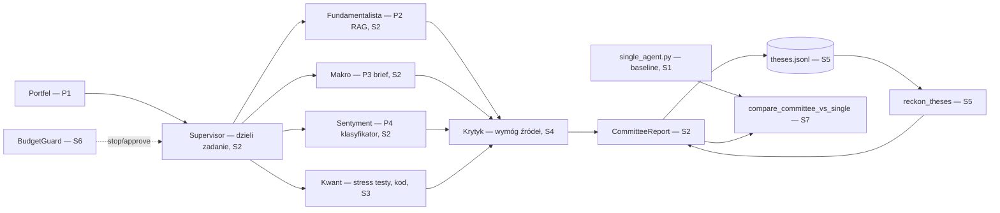

# p5-investment-committee - Architect design

Status: Ready for dev
Owner role: Architect
Upstream: 02-spec.md

ADRs touched: [0002](../../adr/0002-raw-sdk-before-frameworks.md) (raw SDK before frameworks — orchestration here is plain Python + `core.llm`, no new agent framework; nothing in this design needs one), [0005](../../adr/0005-cpu-only-machine-cloud-gpu.md) (no impact — no training here), [0006](../../adr/0006-descriptive-reports-no-investment-advice.md) (REQ-040).

## Context and constraints

- `01-story.md`'s slice sequence (S1 single agent baseline → S2 supervisor+subagents → S3 stress/quant → S4 critic → S5 thesis memory → S6 budget/human-in-the-loop → S7 A/B comparison) is deliberate: S1 exists specifically so S7 has something to compare against, not as throwaway scaffolding.
- Depends on P1 (portfolio), P2 (filings RAG), P3 (market brief), P4 (news classifier) per `01-story.md`. P1-P3 are complete and callable directly. P4 is only through S3 (baselines) — its classifier isn't a finished tool yet, so P5's news-sentiment tool wraps whatever P4 currently exposes (right now: `baselines/tfidf_logreg.py`, swappable later for P4's eventual fine-tuned model) behind one stable interface, never a hardcoded assumption about which P4 slice is live.
- Zero-cost (CLAUDE.md #9) applies exactly as elsewhere, but P5 is the most expensive project in the repo by design (4 subagents + critic + supervisor per run, REQ-021) — the per-run budget stop (REQ-020) is not optional the way it is elsewhere, it's the primary cost control.
- Every numeric result (stress scenarios, portfolio metrics) is computed in code and only explained by a model — same boundary P3's `regime.py` already established, reused here rather than reinvented.

## Quality attribute scenarios

| # | Scenario | Wymaganie |
|---|---|---|
| 1 | Portfel z P1, komitet uruchomiony | raport z 4 perspektywami + rozbieżnościami (REQ-001/002) |
| 2 | Twierdzenie bez źródła w briefie | krytyk odrzuca, wymaga poprawki (REQ-041) |
| 3 | Przebieg po ≥1 miesiącu dla tego samego portfela | rozliczenie tez z tym, co się wydarzyło (REQ-010) |
| 4 | Szacowany koszt przekracza budżet w trakcie przebiegu | zatrzymanie, prośba o akceptację (REQ-020) |
| 5 | Scenariusz stresowy w raporcie | wynik liczony w kodzie, nie przez model (REQ-030) |
| 6 | Ten sam budżet, komitet vs pojedynczy agent | raport porównawczy: jakość, koszt, czas (REQ-050) |

## Otwarte pytania z `02-spec.md` — rozstrzygnięcie Architekta

**#4 Format pamięci tez.** Rozstrzygnięcie: **append-only JSONL per portfel** (`memory/theses.py`), nie plik-migawka jak `market_pulse/state.py` z P3. Różnica jest celowa: P3's state to "tylko ostatni przebieg", nadpisywany co runda — tutaj REQ-011 wymaga historii ocen w czasie (Brier score liczony po wielu tezach), więc nadpisywanie zniszczyłoby dane potrzebne do kalibracji. Wzorzec append-only już istnieje w repo (`news_classifier/corpus_store.py`, P4-S2) — reużyty tu, nie wymyślony od nowa. Plik: `data/memory/investment_committee/<portfolio_id>.jsonl`, gitignored.

## Diagrams



## Contracts

### Pliki

```
src/fin_ai_lab/investment_committee/
  __init__.py
  models.py                        # Claim, Brief, StressScenario, Thesis, CommitteeReport
  tools.py                         # P1/P2/P3/P4 wrapped as AFC-style tools (reuse P3-S2 pattern)
  single_agent.py                  # S1 — one agent, all tools, AFC (baseline for S7)
  supervisor.py                    # S2 — dispatches subagent briefs in parallel, assembles report
  subagents/
    fundamental.py                 # S2 — P2 RAG-backed
    macro.py                       # S2 — P3 brief-backed
    sentiment.py                   # S2 — P4 classifier-backed
    stress.py                      # S3 — pure code, no LLM call at all (REQ-030)
  critic.py                        # S4 — evaluator-optimizer over briefs (REQ-041)
  memory/
    theses.py                      # S5 — append-only JSONL (Open questions #4), reckon_theses
    calibration.py                 # S5 — brier_score
  budget.py                        # S6 — BudgetGuard: hard stop + approval hook (REQ-020/021)
  qa_target.py                     # S7 — eval target for committee-vs-single comparison
  prompts/
    fundamental.v1.md
    macro.v1.md
    sentiment.v1.md
    critic.v1.md
    single_agent.v1.md
tests/investment_committee/         # lustro powyżej
```

### Kontrakty (sygnatury poglądowe)

```python
class Claim(BaseModel):
    text: str
    source_type: Literal["tool_result", "filing_excerpt", "computed_metric"]
    source_ref: str

class Brief(BaseModel):
    perspective: Literal["fundamental", "macro", "sentiment", "stress"]
    conclusion: str
    confidence: float                 # 0.0-1.0
    claims: list[Claim]

class StressScenario(BaseModel):
    name: str
    shock: dict[str, Decimal]         # per-asset-class shock, e.g. {"equities": Decimal("-0.20")}
    portfolio_impact: Decimal         # REQ-030, computed in code — never from the model

class Thesis(BaseModel):
    statement: str
    made_at: date
    horizon: str                      # e.g. "1 month", "1 year" — decides reckoning eligibility
    outcome: Literal["accurate", "inaccurate", "not_yet_resolvable"] | None = None

class CommitteeReport(BaseModel):
    portfolio_id: str
    date: date
    briefs: list[Brief]
    disagreements: list[str]          # REQ-002
    reckoning: list[Thesis]           # REQ-010, empty on the portfolio's first run
    text: str
    cost_usd: Decimal

async def run_single_agent(
    portfolio: Portfolio, llm_client: LlmClient, prompt_registry: PromptRegistry, model: str,
    budget: "BudgetGuard",
) -> CommitteeReport: ...                                                        # S1

async def run_committee(
    portfolio: Portfolio, llm_client: LlmClient, prompt_registry: PromptRegistry, model: str,
    budget: "BudgetGuard",
) -> CommitteeReport: ...                                                        # S2+, adds S3-S6 pieces

def compute_stress_scenarios(
    portfolio: Portfolio, scenarios: list[dict]
) -> list[StressScenario]: ...                                                   # S3, pure function

async def critique_brief(
    brief: Brief, llm_client: LlmClient, prompt_registry: PromptRegistry, model: str
) -> Brief: ...                                                                  # S4, returns a revised brief or the same one if it already passes

def reckon_theses(
    previous_theses: list[Thesis], current_portfolio: Portfolio
) -> list[Thesis]: ...                                                           # S5, fills in `outcome` where resolvable

def brier_score(theses: list[Thesis]) -> float: ...                              # S5, REQ-011

class BudgetGuard:                                                                # S6
    def __init__(self, budget_usd: Decimal, *, max_iterations: int) -> None: ...
    def check(self, estimated_additional_cost: Decimal) -> bool: ...             # False = stop, ask for approval (REQ-020)
    def record(self, actual_cost: Decimal) -> None: ...

async def compare_committee_vs_single(
    portfolio: Portfolio, llm_client: LlmClient, prompt_registry: PromptRegistry, model: str,
    budget_usd: Decimal,
) -> "ComparisonReport": ...                                                      # S7, REQ-050
```

### `subagents/stress.py` — zero wywołań LLM

W przeciwieństwie do pozostałych trzech subagentów, `stress.py` nigdy nie woła modelu — `compute_stress_scenarios` to czysta funkcja nad danymi portfela (REQ-030). Jeśli brief Kwanta ma zawierać komentarz słowny do wyniku, ten komentarz to osobne, jawnie oznaczone wywołanie LLM *po* obliczeniu (ten sam wzorzec co `market_pulse/brief.py` z P3: kod liczy, model tylko opisuje już gotowy wynik) — nie odwrotnie.

### `tools.py` — reużycie P3-S2, nie nowy wzorzec

Narzędzia dla `single_agent.py` (S1) budowane dokładnie jak `market_pulse/tools.py` (P3-S2): zwykłe Python callable z docstringami, przekazywane jako `LlmRequest.tools`, SDK samo dobiera schemat i wykonuje automatic function calling. P4's narzędzie (`get_news_sentiment`) owija to, co P4 aktualnie eksponuje — na dziś `baselines/tfidf_logreg.py`, wymienialne bez zmiany kontraktu narzędzia, gdy P4 dojdzie do właściwego modelu.

### `budget.py::BudgetGuard` — kontrola kosztu per przebieg

Analogiczna do `FIN_AI_LAB_MAX_RUN_COST_USD` (CLAUDE.md #9), ale per przebieg komitetu, nie per klucz API — komitet ma własny budżet (ASSUMPTION z `01-story.md`: ≤1 USD), niezależny od globalnego fail-safe. `check()` wywoływane przed każdym wywołaniem subagenta/krytyka; `False` przerywa przebieg i woła hook akceptacji (REQ-020, kanał do ustalenia — `02-spec.md` odsyła do `01-story.md` pytania #3, wciąż otwartego, nie blokuje kodu S1-S5). `max_iterations` to twardy limit niezależny od kosztu (REQ-021) — agent, który nie zbiega, zatrzymuje się z tego powodu, nie tylko budżetowego.

## Rollout and rollback

1. **P5-S1** `models.py`, `tools.py`, `single_agent.py`, `budget.py` (kontrakt, użyty od razu). Baseline dla S7 — musi istnieć zanim komitet ma się z czym porównywać.
2. **P5-S2** `supervisor.py`, `subagents/fundamental.py`, `macro.py`, `sentiment.py` (bez `stress.py` — to S3). Trzy wywołania LLM równolegle (ten sam wzorzec orchestrator-workers co P3-S4), supervisor składa `CommitteeReport` bez własnych obliczeń (REQ-004).
3. **P5-S3** `subagents/stress.py`, integracja z `supervisor.py`. Wymaga historii cen (`yfinance`, tylko lokalnie — `01-story.md` risk, ten sam wzorzec co `portfolio_xray/metrics/price_history.py`).
4. **P5-S4** `critic.py` — pętla evaluator-optimizer nad briefami z S2/S3, przed złożeniem raportu.
5. **P5-S5** `memory/theses.py`, `memory/calibration.py`. Otwarte pytanie #4 rozstrzygnięte powyżej.
6. **P5-S6** `budget.py`'s hook akceptacji realnie podłączony do wybranego kanału (`01-story.md` pytanie #3, nadal do Tomasza) — kod z S1-S5 działa już z `BudgetGuard`, ten slice tylko podłącza prawdziwe pytanie o zgodę zamiast automatycznej odmowy.
7. **P5-S7** `qa_target.py`, `compare_committee_vs_single` — pairwise porównanie na tym samym budżecie, zgodnie z metryką sukcesu z `01-story.md` (≥60% wygranych portfeli).

Rollback: `git revert` per slice. `data/memory/investment_committee/` to dane (gitignored), nie kod — bezpieczne do usunięcia, kolejny przebieg zacznie bez historii tez (jak pierwszy przebieg, nie błąd).

## Risks

- **Koszt komitetu (4 subagenci + krytyk + supervisor) może przekroczyć budżet szybciej niż w innych projektach.** Mitygacja: `BudgetGuard.check()` przed każdym wywołaniem, nie tylko na starcie (REQ-020).
- **Pętla krytyk↔subagent bez zbieżności.** Mitygacja: `max_iterations` w `BudgetGuard` (REQ-021), niezależny od kosztu — dwa oddzielne twarde limity, nie jeden.
- **P4 niegotowe jako prawdziwy klasyfikator w momencie budowy S2.** Mitygacja: `tools.py`'s narzędzie sentymentu owija cokolwiek P4 aktualnie ma (dziś: baseline TF-IDF+LR), wymienialne bez zmiany kontraktu.
- **Test A/B (S7) wymaga wielu pełnych przebiegów komitetu — realny koszt.** Mitygacja: mały zbiór portfeli testowych na start (`01-story.md` pytanie #1, nadal do Tomasza), nie cały możliwy zakres na raz.

## Handoff notes

- Dev zaczyna od P5-S1 — pojedynczy agent, nie komitet. To nie jest praca do wyrzucenia, S7 go potrzebuje.
- `stress.py` (S3) nigdy nie woła LLM dla samego wyniku liczbowego — tylko dla opcjonalnego komentarza po fakcie, jeśli w ogóle.
- Pytania #1 (portfele testowe) i #3 (kanał akceptacji) z `01-story.md` nadal czekają na Tomasza — nie blokują S1-S5, blokują odpowiednio S1 (realny start) i S6 (prawdziwe podłączenie).
- Pamięć tez to append-only JSONL, nie migawka — nie kopiuj wzorca `market_pulse/state.py` tutaj wprost (Open questions #4).
